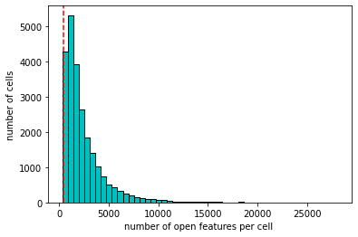
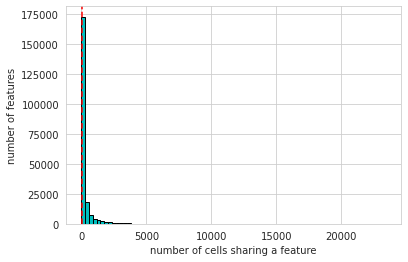
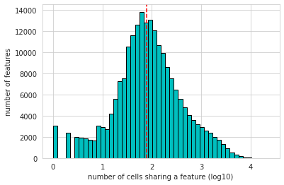

# MOFA分析：scATAC-seq数据处理

由于单细胞ATAC-seq数据依然较大，我们需要对其进行过滤

## 1. 数据准备

### 1.1 导入包

```python
import anndata
import networkx as nx
import scanpy as sc
from matplotlib import rcParams
import pandas as pd
import numpy as np
import episcanpy.api as epi
```

### 1.2 导入数据

```python
atac_pair = anndata.read_h5ad("atac_pair.h5ad")
new_pair=pd.read_csv('mofa_pre_pair.csv')
```

### 1.3 配对细胞重命名

```python
#new_cell=[]
#for i in atac_pair.obs.index:
#  new_cell.append(new_pair[new_pair['scATAC']==i]['sample'].iloc[0])
#atac_pair.obs.index=new_cell
#new_cell[:5]

r1=atac_pair[new_pair['scATAC']]
r1.obs.index=new_pair.index.values
r1.write_h5ad('atac_mofa_pre1.h5ad',compression="gzip")#必须先保存
atac_pair=anndata.read_h5ad("atac_mofa_pre1.h5ad")
```

### 1.4 染色体位置重命名

```python
lo=[]
for i in atac_pair.var_names:
  lo.append(i.replace(':','_').replace('-','_'))
atac_pair.var.index=lo
```

### 1.5 染色体位置相关基因标注

#### 1.5.1 Annotation下载

```shell
wget ftp://ftp.ebi.ac.uk/pub/databases/gencode/Gencode_human/release_19/gencode.v19.annotation.gtf.gz -O gencode.v19.annotation.gtf.gz
gunzip gencode.v19.annotation.gtf
```

#### 1.5.2 Annotation标注

```python
epi.tl.find_genes(atac_pair,
           gtf_file='gencode.v19.annotation.gtf',
           key_added='transcript_annotation',
           upstream=2000,
           feature_type='transcript',
           annotation='HAVANA',
           raw=False)
```

## 2. 数据处理

### 2.1 过滤空feature跟barcode

```python
# remove any potential empty features or barcodes
epi.pp.filter_cells(atac_pair, min_features=1)
epi.pp.filter_features(atac_pair, min_cells=1)
atac_pair
```

> AnnData object with n_obs × n_vars = 23770 × 214125

### 2.2 对数化

```python
atac_pair.obs['log_nb_features'] = [np.log10(x) for x in atac_pair.obs['nb_features']]
epi.pl.violin(atac_pair, ['nb_features'])
epi.pl.violin(atac_pair, ['log_nb_features'])
```


### 2.3 设置每个细胞最小具有的feature数

```python
# set a minimum number of cells to keep 
min_features = 400

epi.pp.coverage_cells(atac_pair, binary=True, log=False, bins=50,
               threshold=min_features, save='Buenrostro_bulk_peaks_coverage_cells.png')
epi.pp.coverage_cells(atac_pair, binary=True, log=10, bins=50,
               threshold=min_features, save='Buenrostro_bulk_peaks_coverage_cells_log10.png')
```




### 2.4 设置每个feature存在于最小的细胞数

```python
# minimum number of cells sharing a feature
min_cells = 80
epi.pp.coverage_features(atac_pair, binary=True, log=False, 
                        threshold=min_cells, save='Buenrostro_bulk_peaks_coverage_peaks.png')
epi.pp.coverage_features(atac_pair, binary=True, log=True, 
                        threshold=min_cells, save='Buenrostro_bulk_peaks_coverage_peaks_log10.png')
```





### 2.5 过滤细胞与feature

```python
min_features = 400
epi.pp.filter_cells(atac_pair, min_features=min_features)
min_cells = 80
epi.pp.filter_features(atac_pair, min_cells=min_cells)
```

### 2.6 计算高变feature

```python
min_score_value = 0.515
nb_feature_selected = 20000
epi.pl.variability_features(atac_pair,log=None,
                     min_score=min_score_value, nb_features=nb_feature_selected,
                     save='variability_features_plot_bonemarrow_peakmatrix.png')

epi.pl.variability_features(atac_pair,log='log10',
                     min_score=min_score_value, nb_features=nb_feature_selected,
                     save='variability_features_plot_bonemarrow_peakmatrix_log10.png')
```


## 3. 过滤高变feature的cell

```python
atac_pair.raw=atac_pair
# create a new AnnData containing only the most variable features
atac_pair = epi.pp.select_var_feature(atac_pair,nb_features=nb_feature_selected,show=False,copy=True)
epi.pl.violin(atac_pair, ['nb_features'])
epi.pl.violin(atac_pair, ['log_nb_features'])
```


```python
epi.pp.filter_cells(atac_pair, min_features=1000)
epi.pp.filter_cells(atac_pair, max_features=4000)
atac_pair.write_h5ad('atac_mofa.h5ad',compression="gzip")
```

