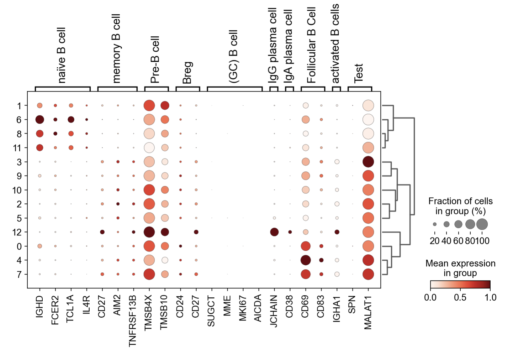
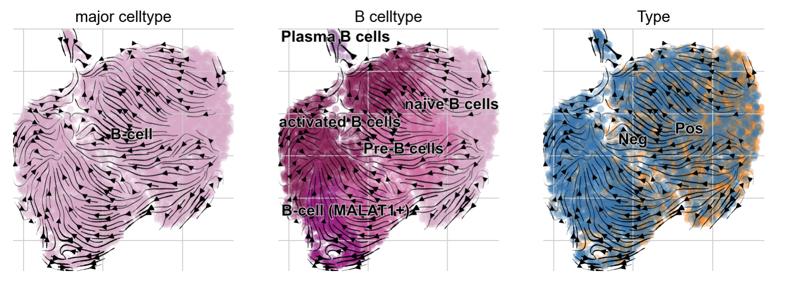
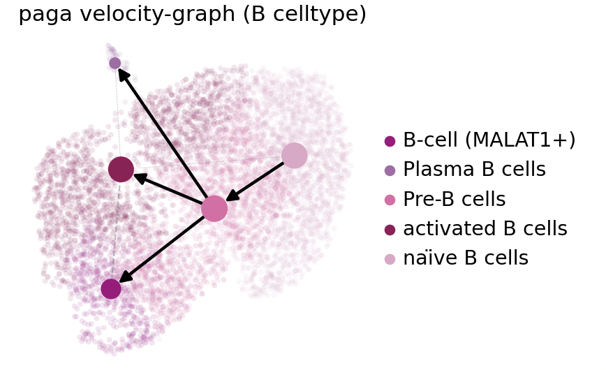

## 4. 细胞亚群分析-真实案例

在这里，我对B细胞亚群进行下游分析（基于乳腺癌淋巴结转移的B细胞数据）

### 4.1 细胞亚群分析

我们首先需要导入包，以及一些相关函数的准备

```python
#导入包
import anndata
print('anndata(Ver): ',anndata.__version__)
import scanpy as sc
print('scanpy(Ver): ',sc.__version__)
import scltnn #非必需
print('scltnn(Ver): ',scltnn.__version__)
import matplotlib.pyplot as plt
import matplotlib
print('matplotlib(Ver): ',matplotlib.__version__)
import seaborn as sns
print('seaborn(Ver): ',sns.__version__)
import numpy as np
print('numpy(Ver): ',np.__version__)
import pandas as pd
print('pandas(Ver): ',pd.__version__)
import scvelo as scv
print('scvelo(Ver): ',scv.__version__)
import Pyomic
print('Pyomic(Ver): ',Pyomic.__version__)

#绘图参数设置
sc.settings.verbosity = 3             # verbosity: errors (0), warnings (1), info (2), hints (3)
sc.settings.set_figure_params(dpi=80, facecolor='white')

sc_color=['#7CBB5F','#368650','#A499CC','#5E4D9A','#78C2ED','#866017','#9F987F', '#E0DFED', '#EF7B77', '#279AD7',
 '#F0EEF0', '#1F577B', '#A56BA7', '#E0A7C8', '#E069A6', '#941456', '#FCBC10', '#EAEFC5', '#01A0A7', '#75C8CC', 
'#F0D7BC', '#D5B26C', '#D5DA48', '#B6B812','#9DC3C3', '#A89C92', '#FEE00C','#FEF2A1']
```

紧接着，我们导入之前标注好细胞类型的rna.h5ad文件，并选取其中的B细胞

```python
adata=sc.read('../cellanno/rna_anno.h5ad')
#筛选
adata=adata[adata.obs['major_celltype']=='B-cell']
```

```shell
View of AnnData object with n_obs × n_vars = 5899 × 1945
    obs: 'Type', 'initial_size_spliced', 'initial_size_unspliced', 'initial_size', 'domain', 'n_genes', 'leiden', 'n_counts', 'major_celltype'
    var: 'gene_ids', 'feature_types', 'genome', 'Accession', 'Chromosome', 'End', 'Start', 'Strand', 'n_cells', 'highly_variable', 'highly_variable_rank', 'means', 'variances', 'variances_norm', 'mean', 'std', 'chrom', 'chromStart', 'chromEnd', 'name', 'score', 'strand', 'thickStart', 'thickEnd', 'itemRgb', 'blockCount', 'blockSizes', 'blockStarts', 'gene_id', 'gene_type', 'hgnc_id', 'havana_gene', 'tag', 'dell'
    uns: 'Type_colors', 'dendrogram_leiden', 'hvg', 'leiden', 'leiden_colors', 'leiden_sizes', 'log1p', 'major_celltype_colors', 'neighbors', 'paga', 'pca', 'rank_genes_groups', 'umap'
    obsm: 'X_glue', 'X_pca', 'X_umap'
    varm: 'PCs', 'X_glue'
    layers: 'Ms', 'Mu', 'ambiguous', 'counts', 'matrix', 'spliced', 'unspliced'
    obsp: 'connectivities', 'distances'
```

我们对数据重新分类别，提取其中的B细胞亚群

```python
sc.tl.pca(adata, n_comps=100, svd_solver="arpack")
sc.pp.neighbors(adata, use_rep="X_glue", metric="cosine",n_neighbors=15, random_state = 112)
sc.tl.leiden(adata)
sc.tl.paga(adata)
sc.pl.paga(adata, plot=False)  # remove `plot=False` if you want to see the coarse-grained graph
sc.tl.umap(adata,init_pos='paga')
sc.pl.umap(adata,color='leiden')
```

输出结果

```shell
computing PCA
    on highly variable genes
    with n_comps=100
    finished (0:00:01)
computing neighbors
    finished: added to `.uns['neighbors']`
    `.obsp['distances']`, distances for each pair of neighbors
    `.obsp['connectivities']`, weighted adjacency matrix (0:00:00)
running Leiden clustering
    finished: found 13 clusters and added
    'leiden', the cluster labels (adata.obs, categorical) (0:00:00)
running PAGA
    finished: added
    'paga/connectivities', connectivities adjacency (adata.uns)
    'paga/connectivities_tree', connectivities subtree (adata.uns) (0:00:00)
--> added 'pos', the PAGA positions (adata.uns['paga'])
computing UMAP
    finished: added
    'X_umap', UMAP coordinates (adata.obsm) (0:00:05)
```


我们接着构建velocity的动态调控过程网

```python
scv.tl.recover_dynamics(adata,n_jobs=6)
scv.tl.velocity(adata, mode='dynamical')
scv.tl.velocity_graph(adata)
scv.pl.velocity_embedding_stream(adata, basis='umap',color=['major_celltype','leiden','Type'])
```

输出结果

```shell
recovering dynamics (using 6/8 cores)
Error displaying widget: model not found
    finished (0:00:13) --> added 
    'fit_pars', fitted parameters for splicing dynamics (adata.var)
computing velocities
    finished (0:00:00) --> added 
    'velocity', velocity vectors for each individual cell (adata.layers)
computing velocity graph (using 1/8 cores)
Error displaying widget: model not found
    finished (0:00:01) --> added 
    'velocity_graph', sparse matrix with cosine correlations (adata.uns)
computing velocity embedding
    finished (0:00:00) --> added
    'velocity_umap', embedded velocity vectors (adata.obsm)
```


我们接着计算拟时序

```python
scv.tl.latent_time(adata)
scv.pl.scatter(adata, color='latent_time', color_map='Reds', size=80)
```

输出结果

```shell
computing terminal states
    identified 4 regions of root cells and 1 region of end points .
    finished (0:00:00) --> added
    'root_cells', root cells of Markov diffusion process (adata.obs)
    'end_points', end points of Markov diffusion process (adata.obs)
computing latent time using root_cells as prior
    finished (0:00:00) --> added 
    'latent_time', shared time (adata.obs)
```


然后，我们使用B细胞的字典，来对B细胞的细胞类型进行标注，并且使用t-test找出每一类leiden的marker基因用于辅助注释

```python
#B细胞字典
res_marker_dict={
    'naïve B cell':['IGHD', 'FCER2', 'TCL1A', 'IL4R'],
    'memory B cell':['CD27','AIM2','TNFRSF13B'],
    'Pre-B cell':['TMSB4X','TMSB10'],
    'Breg': ['CD24','CD27'],
    '(GC) B cell':[ 'SUGCT', 'MME', 'MKI67', 'AICDA'],
    'IgG plasma cell':['JCHAIN'],
    'IgA plasma cell':['CD38'],
    'Follicular B Cell':['CD69','CD83'],
    'activated B cells':['IGHA1'],
    'Test':['SPN','MALAT1'],
}
sc.tl.dendrogram(adata,'leiden')
sc.pl.dotplot(adata, res_marker_dict, 'leiden', dendrogram=True,standard_scale='var')
```

输出结果

```shell
    using 'X_pca' with n_pcs = 100
Storing dendrogram info using `.uns['dendrogram_leiden']`
WARNING: Groups are not reordered because the `groupby` categories and the `var_group_labels` are different.
categories: 0, 1, 2, etc.
var_group_labels: naïve B cell, memory B cell, Pre-B cell, etc.
```



```python
#注意，这里也可以使用cosg来寻找marker基因
adata.uns['log1p']['base']=None
sc.tl.rank_genes_groups(adata, 'leiden', method='t-test')
sc.pl.rank_genes_groups_dotplot(adata,groupby='leiden',
                                cmap='Spectral_r',
                                standard_scale='var',n_genes=3)
```

输出结果

```shell
ranking genes
WARNING: It seems you use rank_genes_groups on the raw count data. Please logarithmize your data before calling rank_genes_groups.
    finished (0:00:00)
```


最后，我们标注leiden对应的细胞类型，并上色

```python
#leiden对应的细胞类型标注
cluster2annotation = {
     '0': 'activated B cells',
     '1': 'naïve B cells',
     '2': 'Pre-B cells',
     '3': 'B-cell (MALAT1+)',
     '4': 'activated B cells',
     '5': 'Pre-B cells',
     '6': 'naïve B cells',
     '7': 'activated B cells',
     '8': 'naïve B cells',
     '9': 'Pre-B cells',
     '10': 'Pre-B cells',
     '11': 'naïve B cells',
     '12': 'Plasma B cells',
}
adata.obs['B_celltype'] = adata.obs['leiden'].map(cluster2annotation).astype('category')

#上色
type_color_B={
    'naïve B cells':sc_color[13],
    'Follicular B cells':sc_color[20],
    'Pre-B cells':sc_color[14],
    'activated B cells':sc_color[15],
    'IgA+ Plasma B cells':sc_color[8],
    'IgG+ Plasma B cells':sc_color[12],
    'Plasma B cells':sc_color[12],
    'B-cell':sc_color[13],
    'B-cell (MALAT1+)':'#a3007d',

}
adata.uns['B_celltype_colors']=adata.obs['B_celltype'].cat.categories.map(type_color_B).values.tolist()

#绘制效果
ax=scv.pl.velocity_embedding_stream(adata, basis='umap',color=['major_celltype','B_celltype','Type'],
                                legend_align_text='y',show=False,)
plt.savefig("prop/cell_type.png",dpi=300,bbox_inches = 'tight')
```



然后，为了分析阴性淋巴结跟阳性淋巴结的细胞比例差异，我们计算了两种淋巴结中的细胞比例

```python
#阳性淋巴结
import numpy as np
import matplotlib.pyplot as plt
from pylab import *
#mpl.rcParams['font.sans-serif']=['SimHei']
#mpl.rcParams['axes.unicode_minus']=False
labels=(adata[adata.obs['Type']=='Pos'].obs['B_celltype'].value_counts()/len(adata[adata.obs['Type']=='Pos'].obs)).index.tolist()
data=(adata[adata.obs['Type']=='Pos'].obs['B_celltype'].value_counts()/len(adata[adata.obs['Type']=='Pos'].obs)).values
b_color=pd.DataFrame(labels)[0].map(type_color_B).values
explodes=[i for i in [0.1]*len(labels)]
 
fig, ax = plt.subplots(figsize=(2,2)) 
#plt.axes(aspect=0.5)
plt.pie(x=data,labels=labels,autopct="%0.1f%%",labeldistance=None,
        explode=explodes,shadow=True,colors=b_color)
plt.title('Pos Lym')
plt.savefig("prop/pos_prop.png",dpi=300,bbox_inches = 'tight')

```


```python
#阴性淋巴结
import numpy as np
import matplotlib.pyplot as plt
from pylab import *
labels=(adata[adata.obs['Type']=='Neg'].obs['B_celltype'].value_counts()/len(adata[adata.obs['Type']=='Neg'].obs)).index.tolist()
#labels=[i for i in [' ']*5]
data=(adata[adata.obs['Type']=='Neg'].obs['B_celltype'].value_counts()/len(adata[adata.obs['Type']=='Neg'].obs)).values
b_color=pd.DataFrame(labels)[0].map(type_color_B).values
explodes=[i for i in [0.1]*len(labels)]
 
fig, ax = plt.subplots(figsize=(2,2)) 
#plt.axes(aspect=0.5)
plt.pie(x=data,labels=labels,autopct="%0.1f%%",labeldistance=None,
        explode=explodes,shadow=True,colors=b_color)
plt.legend(bbox_to_anchor=(1.8, 0.7), ncol=3,fontsize=10)
plt.title('Neg Lym')
plt.grid(False)
plt.axis('off')
plt.savefig("prop/neg_prop.png",dpi=300,bbox_inches = 'tight')

```


除了使用扇形图外，我们还能用柱状图更加直观的感受细胞类型的比例，我们先构建一个pandas表格用于绘制柱状图

```python
prop_pd1=pd.DataFrame(index=list(set(adata.obs['B_celltype'])))
prop_pd1['Cell']=prop_pd1.index.tolist()
prop_pd1['Values']=0
prop_pd1['Type']='Neg'
data=(adata[adata.obs['Type']=='Neg'].obs['B_celltype'].value_counts()/len(adata[adata.obs['Type']=='Neg'].obs))
prop_pd1.loc[data.index.tolist(),'Values']=[round(i,2) for i in data.values]


prop_pd2=pd.DataFrame(index=list(set(adata.obs['B_celltype'])))
prop_pd2['Cell']=prop_pd2.index.tolist()
prop_pd2['Values']=0
prop_pd2['Type']='Pos'
data=(adata[adata.obs['Type']=='Pos'].obs['B_celltype'].value_counts()/len(adata[adata.obs['Type']=='Pos'].obs))
prop_pd2.loc[data.index.tolist(),'Values']=[round(i,2) for i in data.values]

prop_pd=pd.concat([prop_pd1,prop_pd2])
prop_pd.index=range(len(prop_pd))
prop_pd
```

|      |              Cell | Values | Type |
| ---: | ----------------: | -----: | ---: |
|    0 |  B-cell (MALAT1+) |   0.13 |  Neg |
|    1 |       Pre-B cells |   0.27 |  Neg |
|    2 |     naïve B cells |   0.21 |  Neg |
|    3 |    Plasma B cells |   0.01 |  Neg |
|    4 | activated B cells |   0.38 |  Neg |
|    5 |  B-cell (MALAT1+) |   0.06 |  Pos |
|    6 |       Pre-B cells |   0.37 |  Pos |
|    7 |     naïve B cells |   0.40 |  Pos |
|    8 |    Plasma B cells |   0.00 |  Pos |
|    9 | activated B cells |   0.16 |  Pos |

随后我们分别为Neg与Pos指定颜色后绘制柱状图

```python
type_color={
    'Pos':'#9B7170',
    'Neg':'#C65A50'
}

fig, ax = plt.subplots(figsize=(2,4)) 

sns.barplot(
    data=prop_pd, 
    x="Values", y="Cell", hue="Type",
    alpha=.6,palette=[type_color['Neg'],type_color['Pos']]
)
for i in ax.containers:
    ax.bar_label(i,)
sns.move_legend(ax, "upper left", bbox_to_anchor=(1, 1))

plt.savefig("prop/prop.png",dpi=300,bbox_inches = 'tight')
```


除此之外，我们还可以分析细胞亚群的演变过程

```python
scv.tl.paga(adata, groups='B_celltype',use_time_prior=False)
scv.pl.paga(adata, basis='umap', size=50, alpha=.1,
            min_edge_width=2, node_size_scale=1.5)
```

输出结果

```shell
running PAGA 
    finished (0:00:00) --> added
    'paga/connectivities', connectivities adjacency (adata.uns)
    'paga/connectivities_tree', connectivities subtree (adata.uns)
    'paga/transitions_confidence', velocity transitions (adata.uns)
```



到此，细胞亚群注释及相关的图表，我们就绘制完成了，我们保存一下

```python
adata.write_h5ad('B_cell_anno_new.h5ad',compression='gzip')
```

