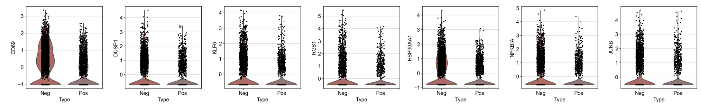
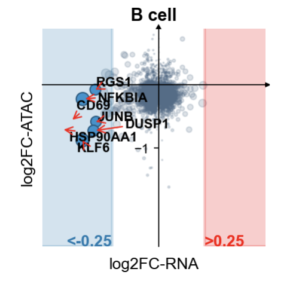

### 4.2 差异表达分析

我们需要分析的是阴性淋巴结与阳性淋巴结，一个很直观的思想就是，我们是不是希望知道阳性淋巴结跟阴性淋巴结有什么区别？那么我们现在得到了淋巴结的scRNA-seq与scATAC-seq数据，我们是不是可以找出两个组学层的共同点？

我们首先导入包

我们首先需要导入包，以及一些相关函数的准备

```python
#导入包
import anndata
print('anndata(Ver): ',anndata.__version__)
import scanpy as sc
print('scanpy(Ver): ',sc.__version__)
import scltnn #非必需
print('scltnn(Ver): ',scltnn.__version__)
import matplotlib.pyplot as plt
import matplotlib
print('matplotlib(Ver): ',matplotlib.__version__)
import seaborn as sns
print('seaborn(Ver): ',sns.__version__)
import numpy as np
print('numpy(Ver): ',np.__version__)
import pandas as pd
print('pandas(Ver): ',pd.__version__)
import scvelo as scv
print('scvelo(Ver): ',scv.__version__)
import Pyomic
print('Pyomic(Ver): ',Pyomic.__version__)

#绘图参数设置
sc.settings.verbosity = 3             # verbosity: errors (0), warnings (1), info (2), hints (3)
sc.settings.set_figure_params(dpi=80, facecolor='white')

sc_color=['#7CBB5F','#368650','#A499CC','#5E4D9A','#78C2ED','#866017','#9F987F', '#E0DFED', '#EF7B77', '#279AD7',
 '#F0EEF0', '#1F577B', '#A56BA7', '#E0A7C8', '#E069A6', '#941456', '#FCBC10', '#EAEFC5', '#01A0A7', '#75C8CC', 
'#F0D7BC', '#D5B26C', '#D5DA48', '#B6B812','#9DC3C3', '#A89C92', '#FEE00C','#FEF2A1']
```

我们在前面已经完成了GLUE的分析了，意味着我们拿到了配对好的细胞结果，所以我们这里定义一个新的函数用于配对细胞

```python
def adata_rename(adata,pair,omic_name='omic_1'):
    ret=list(set(pair[omic_name].values) & set(adata.obs.index))
    new_pair=pair.loc[pair[omic_name].isin(ret)]
    adata=adata[new_pair[omic_name].values]
    adata.obs.index=new_pair.index
    return adata
```

该函数需要的pair文件如下

```python
#其中omic_1代表rna层，omic_2代表atac层
res_pair=pd.read_csv('../multi_omics/res_pair.csv')
res_pair.set_index(res_pair.columns[0],inplace=True)
res_pair.head()
```

|            |             omic_1 |                 omic_2 |
| ---------: | -----------------: | ---------------------: |
| Unnamed: 0 |                    |                        |
|     cell_0 |   AACTCAGCATGATCCA | neg-GCACGGTGTGCAAGAC-1 |
|     cell_1 |   AAACGGGTCGGCGCAT | neg-TCTATTGAGAGGCAGG-1 |
|     cell_2 |   GACGCGTAGACAAGCC | neg-GTGTCCTGTCATTGCA-1 |
|     cell_3 | AAACCTGTCCCAACGG-1 | neg-AGTGTACCATGTGGGA-1 |
|     cell_4 |   CATATTCCAAACCCAT | neg-TCAGCTCCAACGGGTA-1 |

我们读取前面注释好的B细胞的rna文件，并使用我们定义的这个函数筛选出配对好的细胞

```python
rna=sc.read('B_cell_anno_new.h5ad')
rna=adata_rename(rna,res_pair,'omic_1')
rna
```

输出结果

```shell
View of AnnData object with n_obs × n_vars = 4315 × 1945
    obs: 'Type', 'initial_size_spliced', 'initial_size_unspliced', 'initial_size', 'domain', 'n_genes', 'leiden', 'n_counts', 'major_celltype', 'velocity_self_transition', 'root_cells', 'end_points', 'velocity_pseudotime', 'latent_time', 'B_celltype'
    var: 'gene_ids', 'feature_types', 'genome', 'Accession', 'Chromosome', 'End', 'Start', 'Strand', 'n_cells', 'highly_variable', 'highly_variable_rank', 'means', 'variances', 'variances_norm', 'mean', 'std', 'chrom', 'chromStart', 'chromEnd', 'name', 'score', 'strand', 'thickStart', 'thickEnd', 'itemRgb', 'blockCount', 'blockSizes', 'blockStarts', 'gene_id', 'gene_type', 'hgnc_id', 'havana_gene', 'tag', 'dell', 'fit_r2', 'fit_alpha', 'fit_beta', 'fit_gamma', 'fit_t_', 'fit_scaling', 'fit_std_u', 'fit_std_s', 'fit_likelihood', 'fit_u0', 'fit_s0', 'fit_pval_steady', 'fit_steady_u', 'fit_steady_s', 'fit_variance', 'fit_alignment_scaling', 'velocity_genes'
    uns: 'B_celltype_colors', 'B_celltype_sizes', 'Type_colors', 'cosg', 'dendrogram_B_celltype', 'dendrogram_leiden', 'hvg', 'leiden', 'leiden_colors', 'leiden_sizes', 'log1p', 'major_celltype_colors', 'neighbors', 'paga', 'pca', 'rank_genes_groups', 'recover_dynamics', 'umap', 'velocity_graph', 'velocity_graph_neg', 'velocity_params'
    obsm: 'X_glue', 'X_pca', 'X_umap', 'velocity_umap'
    varm: 'PCs', 'X_glue', 'loss'
    layers: 'Ms', 'Mu', 'ambiguous', 'counts', 'fit_t', 'fit_tau', 'fit_tau_', 'matrix', 'spliced', 'unspliced', 'velocity', 'velocity_u'
    obsp: 'connectivities', 'distances'

```

我们读取没有注释的atac_gs_anno文件(这是基因活性矩阵)，并使用前面定义的`adata_rename`函数以及rna的obs特征筛选出配对好的细胞

```python
atac_act=sc.read('../cellanno/atac_gs_anno.h5ad')
atac_act=adata_rename(atac_act,res_pair,'omic_2')
atac_act=atac_act[rna.obs.index]
atac_act=atac_act.raw.to_adata()
atac_act.obs=rna.obs
atac_act
```

输出结果

```shell
AnnData object with n_obs × n_vars = 4315 × 28307
    obs: 'Type', 'initial_size_spliced', 'initial_size_unspliced', 'initial_size', 'domain', 'n_genes', 'leiden', 'n_counts', 'major_celltype', 'velocity_self_transition', 'root_cells', 'end_points', 'velocity_pseudotime', 'latent_time', 'B_celltype'
    var: 'mt', 'n_cells_by_counts', 'mean_counts', 'pct_dropout_by_counts', 'total_counts'
    uns: 'Type_colors', 'dendrogram_leiden', 'leiden', 'leiden_colors', 'leiden_sizes', 'log1p', 'major_celltype_colors', 'neighbors', 'paga', 'pca', 'rank_genes_groups', 'umap'
    obsm: 'X_glue', 'X_lsi', 'X_pca', 'X_umap'
    obsp: 'connectivities', 'distances'
```

随后，我们定义了一个新的函数，用来计算阳性跟阴性的淋巴结之间的差异表达情况

```python
from scipy  import stats,sparse

def scdeg(adata1,adata2):
    mean1=adata1.X.mean(axis=0)
    mean2=adata2.X.mean(axis=0)
    
    if sparse.issparse(adata1.X):
        fold=np.array(adata1.X.mean(axis=0)-adata2.X.mean(axis=0))[0]
        #fold=fold[0]
        #log2fold=np.log2(fold)
        ttest = stats.ttest_ind(adata1[:,:].X.toarray(),adata2[:,:].X.toarray())
    else:
        fold=adata1.X.mean(axis=0)-adata2.X.mean(axis=0)
        #log2fold=np.log2(fold)
        ttest = stats.ttest_ind(adata1[:,:].X,adata2[:,:].X)
    pvalue=ttest.pvalue
    
    res=pd.DataFrame(index=adata1.var.index)
    res['log2FC']=fold
    res['pvalue']=pvalue
    return res

def scdeg_atac(adata1,adata2):
    mean1=adata1.X.mean(axis=0)
    mean2=adata2.X.mean(axis=0)
    
    if sparse.issparse(adata1.X):
        fold=np.array(adata1.X.mean(axis=0)/adata2.X.mean(axis=0))[0]
        #fold=fold[0]
        log2fold=np.log2(fold+0.0000001)
        ttest = stats.ttest_ind(adata1[:,:].X.toarray(),adata2[:,:].X.toarray())
    else:
        fold=adata1.X.mean(axis=0)/adata2.X.mean(axis=0)
        log2fold=np.log2(fold+0.0000001)
        ttest = stats.ttest_ind(adata1[:,:].X,adata2[:,:].X)
    pvalue=ttest.pvalue
    
    res=pd.DataFrame(index=adata1.var.index)
    res['log2FC']=log2fold
    res['pvalue']=pvalue
    return res
```

我们对rna数据进行预处理，注意，在这里，我们不对atac的活性矩阵数据进行预处理

```python
#得到rna跟atac共有的基因集
ret_gene=list(set(rna.raw.var.index.tolist()) & set(atac_act.var.index.tolist()))
len(ret_gene)
#筛选共有基因
deg_rna=rna.raw.to_adata()[:,ret_gene]
deg_atac_act=atac_act[:,ret_gene]
deg_rna,deg_atac_act
#rna预处理
sc.pp.normalize_total(deg_rna)
sc.pp.log1p(deg_rna)
sc.pp.scale(deg_rna)
```

我们首先研究B细胞总体的差异表达情况

```python
b_cell_type=''

deg_r=scdeg(deg_rna[(deg_rna.obs['Type']=='Pos')&(deg_rna.obs['B_celltype']!=b_cell_type)],
            deg_rna[(deg_rna.obs['Type']=='Neg')&(deg_rna.obs['B_celltype']!=b_cell_type)])
deg_r.columns=[i+'-rna' for i in deg_r.columns]

deg_a=scdeg_atac(deg_atac_act[(deg_atac_act.obs['Type']=='Pos')&(deg_atac_act.obs['B_celltype']!=b_cell_type)],
            deg_atac_act[(deg_atac_act.obs['Type']=='Neg')&(deg_atac_act.obs['B_celltype']!=b_cell_type)])
deg_a.columns=[i+'-atac' for i in deg_a.columns]

```

我们得到了`deg_r`与`deg_a`两个DataFrame，分别存储了相关的差异细胞类型，我们接着合并这两个DataFrame，用于后续的绘图

```python
deg_b=pd.concat([deg_r,deg_a],join='outer',axis=1)
deg_b['sig']='normal'
deg_b.loc[(deg_b['log2FC-rna']<-0.3) & (deg_b['log2FC-atac']<-0.01) & (deg_b['pvalue-rna']<0.05) & (deg_b['pvalue-atac']<0.05),'sig']='down-closed'
deg_b.loc[(deg_b['log2FC-rna']>0.3) & (deg_b['log2FC-atac']>0.01) & (deg_b['pvalue-rna']<0.05) & (deg_b['pvalue-atac']<0.05),'sig']='up-open'

deg_b.loc[(deg_b['log2FC-rna']<-0.3) & (deg_b['log2FC-atac']>0.01) & (deg_b['pvalue-rna']<0.05) & (deg_b['pvalue-atac']<0.05),'sig']='down-open'
deg_b.loc[(deg_b['log2FC-rna']>0.3) & (deg_b['log2FC-atac']<-0.01) & (deg_b['pvalue-rna']<0.05) & (deg_b['pvalue-atac']<0.05),'sig']='up-closed'

deg_b.loc[deg_b['sig']!='normal']
```

|          | log2FC-rna |   pvalue-rna | log2FC-atac |  pvalue-atac |         sig |
| -------: | ---------: | -----------: | ----------: | -----------: | ----------: |
|     CD69 |  -0.481565 | 0.000000e+00 |   -0.414049 | 7.953599e-15 | down-closed |
|    DUSP1 |  -0.351880 | 8.813636e-31 |   -0.334110 | 4.529727e-15 | down-closed |
|     KLF6 |  -0.412127 | 8.021032e-42 |   -0.394257 | 1.385903e-16 | down-closed |
|     RGS1 |  -0.342126 | 3.633539e-29 |   -0.183141 | 3.073230e-02 | down-closed |
| HSP90AA1 |  -0.530347 | 0.000000e+00 |   -0.333989 | 1.227807e-11 | down-closed |
|   NFKBIA |  -0.409938 | 2.176217e-41 |   -0.218099 | 7.971724e-05 | down-closed |
|     JUNB |  -0.335438 | 4.362629e-28 |   -0.257169 | 1.043540e-08 | down-closed |

我们可以可视化一下这些差异表达基因在不同淋巴结中的分布情况

```python
type_color={
    'Pos':'#9B7170',
    'Neg':'#C65A50'
}
#在rna中
sc.pl.violin(deg_rna[deg_rna.obs['B_celltype']!=b_cell_type], 
             deg_b.loc[deg_b['sig']!='normal'].index.tolist(), groupby='Type',size=3,palette=['#C65A50','#9B7170'])
```



```python
#在gene-activity中
sc.pl.violin(deg_atac_act[deg_atac_act.obs['B_celltype']!=b_cell_type], 
             deg_b.loc[deg_b['sig']!='normal'].index.tolist(), 
             groupby='Type',size=3,palette=['#C65A50','#9B7170'],
            title=deg_b.loc[deg_b['sig']!='normal'].index.tolist(),stripplot=True)
```


我们接下来绘制本小节最关键的图，差异表达图

```python
from adjustText import adjust_text
plt.figure(figsize=(3, 3))
plt.scatter(deg_b.loc[deg_b['sig']=='normal']['log2FC-rna'],
            deg_b.loc[deg_b['sig']=='normal']['log2FC-atac'],
            s=-np.log(deg_r.loc[deg_b['sig']=='normal']['pvalue-rna']),color='#4e6d89',alpha=.2,)

plt.scatter(deg_b.loc[deg_b['sig']=='up-open']['log2FC-rna'],
            deg_b.loc[deg_b['sig']=='up-open']['log2FC-atac'],
            s=-np.log(deg_r.loc[deg_b['sig']=='up-open']['pvalue-rna']),color=sc_color[15],
           linewidths=1,edgecolors=sc_color[14])

plt.scatter(deg_b.loc[deg_b['sig']=='up-closed']['log2FC-rna'],
            deg_b.loc[deg_b['sig']=='up-closed']['log2FC-atac'],
            s=-np.log(deg_r.loc[deg_b['sig']=='up-closed']['pvalue-rna']),color=sc_color[14],
           linewidths=1,edgecolors=sc_color[15])

plt.scatter(deg_b.loc[deg_b['sig']=='down-open']['log2FC-rna'],
            deg_b.loc[deg_b['sig']=='down-open']['log2FC-atac'],
            s=-np.log(deg_r.loc[deg_b['sig']=='down-open']['pvalue-rna']),color='#5ca8dc',
           linewidths=1,edgecolors='#4f61c7')

plt.scatter(deg_b.loc[deg_b['sig']=='down-closed']['log2FC-rna'],
            deg_b.loc[deg_b['sig']=='down-closed']['log2FC-atac'],
            s=-np.log(deg_r.loc[deg_b['sig']=='down-closed']['pvalue-rna']),color=sc_color[9],
           linewidths=1,edgecolors=sc_color[11])

plot_index=deg_b.loc[deg_b['sig']!='normal'].index
texts=[plt.text(deg_b.loc[i,'log2FC-rna'],deg_b.loc[i,'log2FC-atac'],i
        ,fontdict={'size':10,'weight':'bold'}) for i in plot_index[:20]]

adjust_text(texts,only_move={'text': 'xy'},arrowprops=dict(arrowstyle='->', color='red'),)

ax = plt.gca()
# 去掉上、右二侧的边框线
ax.spines['top'].set_color('none')
ax.spines['right'].set_color('none')
 
# 将左侧的y轴，移到x=0的位置
ax.spines['left'].set_position(('data', 0))
ax.spines['bottom'].set_position(('data', 0))
plt.tick_params(labelsize=10)
plt.grid(None)


print('log2FC-rna',deg_b['log2FC-rna'].min(),deg_b['log2FC-rna'].max())
print('log2FC-atac',deg_b['log2FC-atac'].min(),deg_b['log2FC-atac'].max())

plot_xmin=round(deg_b['log2FC-rna'].min(),2)-0.1
plot_xmax=round(deg_b['log2FC-rna'].max(),2)+0.1
plot_ymin=round(deg_b['log2FC-atac'].min(),2)-0.1
plot_ymax=round(deg_b['log2FC-atac'].max(),2)+0.1

plt.xlim(plot_xmin,plot_xmax)
plt.ylim(plot_ymin,plot_ymax)

plt.arrow(0, plot_ymax, 0, 0, width=0.01, color="k", clip_on=False, head_width=0.02, head_length=0.05)
plt.arrow(plot_xmax, 0, 0.001, 0, width=0.01, color="k", clip_on=False, head_width=0.05, head_length=0.02)


plt.gca().add_patch(plt.Rectangle(xy=(0.25,plot_ymin),
width=15, color='red',
height=10,alpha=.2,
fill=True, linewidth=2))

plt.gca().add_patch(plt.Rectangle(xy=(-0.25,plot_ymin),
width=-15, color='#177cb0',
height=10,alpha=.2,
fill=True, linewidth=2))

ax.set_ylabel('log2FC-ATAC', ha='left', y=2, rotation=90, labelpad=75)
ax.set_xlabel('log2FC-RNA', ha='left', y=0, rotation=0, labelpad=130)
plt.text(0.25,plot_ymin,'>0.25',fontsize=12,color='red',fontweight='bold')
plt.text(-0.25,plot_ymin,'<-0.25',fontsize=12,color='#177cb0',ha='right',fontweight='bold')

plt.xlabel('log2FC-RNA',fontsize=12,)
plt.ylabel('log2FC-ATAC',fontsize=12,)
plt.title('B cell',fontsize=13,fontweight='bold')

plt.yticks(np.linspace(-1, 0.5, 1))
plt.xticks(np.linspace(-1, 0.5, 1))

plt.savefig("deg/deg_{}.png".format(b_cell_type),dpi=300,bbox_inches = 'tight')
```



我们可以使用同样的方法，绘制出其他5种不同的B细胞亚群的基因分布图