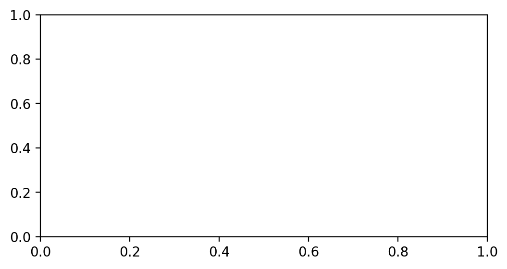
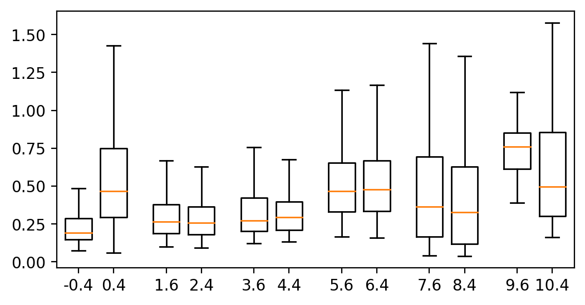
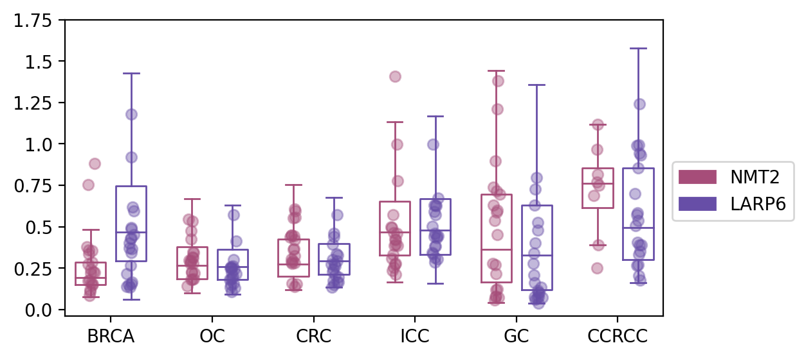
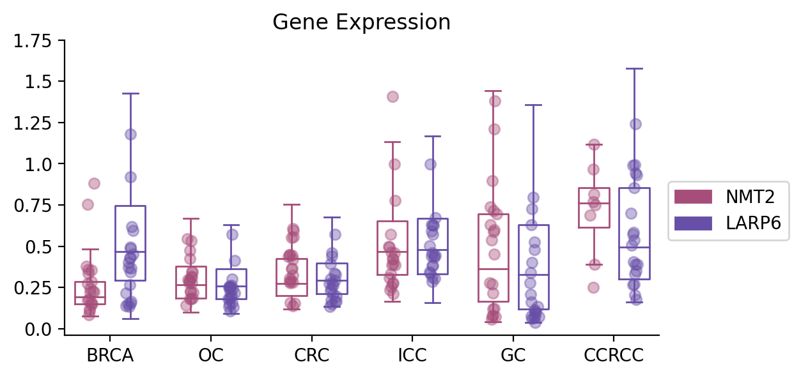

## 2. 基因表达图（箱线图）

带来的第二个图，是一个比较常见的箱线图，seaborn虽然也能用一行代码画出来，但是我想改成空心的就比较麻烦，并且可能由于包的版本不兼容，
所以导致我们最后画出来的图难以修改，所以在这里，我们将使用matplotlib从头画一遍。

**数据下载地址：https://github.com/Starlitnightly/bioinformatic_tutorial/tree/main/PLOT/data/data_exp.csv**

### 2.1 画图配置

我们首先配置一下jupyter的显示效果，这里用了retina作为显示的图片格式，其次导入了一些常见的包，并提供了一个色卡


```python
%matplotlib inline
%config InlineBackend.figure_format = 'retina'

#导入包，我有一个习惯就是把导入的包的版本号同时打印出来，这样别人出问题的时候，也能知道到底是哪个版本没对上
import matplotlib.pyplot as plt
import matplotlib
from matplotlib.colors import LinearSegmentedColormap
import matplotlib.patches as mpatches
print('matplotlib(Ver): ',matplotlib.__version__)

import seaborn as sns
print('seaborn(Ver): ',sns.__version__)

import numpy as np
print('numpy(Ver): ',np.__version__)

import pandas as pd
print('pandas(Ver): ',pd.__version__)

import random

#色卡，这里提供一个我画图常用的色卡，我一般画图的颜色都是从里面选取的
sc_color=['#7CBB5F','#368650','#A499CC','#5E4D9A','#78C2ED','#866017', '#9F987F','#E0DFED',
 '#EF7B77', '#279AD7','#F0EEF0', '#1F577B', '#A56BA7', '#E0A7C8', '#E069A6', '#941456', '#FCBC10',
 '#EAEFC5', '#01A0A7', '#75C8CC', '#F0D7BC', '#D5B26C', '#D5DA48', '#B6B812', '#9DC3C3', '#A89C92', '#FEE00C', '#FEF2A1']
plt.figure(figsize=(8, 2))
for i in range(len(sc_color)):
    plt.scatter(i, 1, c=sc_color[i], s=200)
plt.show()

```

    matplotlib(Ver):  3.5.1
    seaborn(Ver):  0.11.2
    numpy(Ver):  1.23.4
    pandas(Ver):  1.5.1


    


### 2.2 数据准备

#### 2.2.1 导入数据

在这里，我们导入了绘制箱线图需要的数据，这里的数据是来源于正常组织与癌组织的两个基因的表达情况。


```python
#设置文件路径
current_path='/home/xiongyy/analysis/PLOT/'
#使用read_csv导入csv文件
data=pd.read_csv(current_path+'data/data_exp.csv')

data.head()
```


<div>
<style scoped>
    .dataframe tbody tr th:only-of-type {
        vertical-align: middle;
    }


    .dataframe tbody tr th {
        vertical-align: top;
    }
    
    .dataframe thead th {
        text-align: right;
    }

</style>

<table border="1" class="dataframe">
  <thead>
    <tr style="text-align: right;">
      <th></th>
      <th>value</th>
      <th>gene</th>
      <th>X</th>
      <th>cancer</th>
    </tr>
  </thead>
  <tbody>
    <tr>
      <th>0</th>
      <td>1.025118</td>
      <td>LARP6</td>
      <td>0.005022</td>
      <td>BRCA</td>
    </tr>
    <tr>
      <th>1</th>
      <td>0.292682</td>
      <td>LARP6</td>
      <td>0.007507</td>
      <td>BRCA</td>
    </tr>
    <tr>
      <th>2</th>
      <td>0.692980</td>
      <td>LARP6</td>
      <td>0.005022</td>
      <td>BRCA</td>
    </tr>
    <tr>
      <th>3</th>
      <td>1.436567</td>
      <td>LARP6</td>
      <td>0.007507</td>
      <td>BRCA</td>
    </tr>
    <tr>
      <th>4</th>
      <td>1.890317</td>
      <td>LARP6</td>
      <td>0.005022</td>
      <td>BRCA</td>
    </tr>
  </tbody>
</table>

</div>


#### 2.2.2 数据预处理

我们前面导入的数据，还不满足我们箱线图绘制的格式，我们对数据进行初步处理，我们目标的箱线图：

- 1）最终是透明的内框，并且还有着部分散点的分布，
- 2）此外，分布的数据点应该呈现抖动，并不是全部都在一条直线上
- 3）此外，对于数据点而言，我们可以随机选取20个作为代表进而反应数据总体特征。

为了满足这些需求，要求我们对数据需要进行一些预处理


```python
#获取箱子位置的函数，如果是两个箱子，那么其应该是在坐标两侧根据width分隔
#如果是三个箱子，那么坐标的位置箱子width各占一半，再根据width进行分隔
def ticks_range(x,width):
    nticks=[]
    pticks=[]
    start=-(x//2)
    end=(x//2)
    for i in range(x//2):
        nticks.append(start+width)
        start+=width
        pticks.append(end-width)
        end-=width
    if x%2==0:
        ticks=nticks+pticks
    elif x%2==1:
        ticks=nticks+[0]+pticks
    return ticks
```


```python
#获取需要分割的数据
hue='gene'
hue_datas=list(set(data[hue]))

#获取箱线图的横坐标
x='cancer'
ticks=list(set(data[x]))

#在这个数据中，我们有6个不同的癌症，每个癌症都有2个基因（2个箱子）
#所以我们需要得到每一个基因的6个箱线图位置，6个散点图的抖动
plot_data1={}#字典里的每一个元素就是每一个基因的所有值
plot_data_random1={}#字典里的每一个元素就是每一个基因的随机20个值
plot_data_xs1={}#字典里的每一个元素就是每一个基因的20个抖动值


#箱子的参数
width=0.6
y='value'
for hue_data,num in zip(hue_datas,ticks_range(len(hue_datas),width)):
    data_a=[]
    data_a_random=[]
    data_a_xs=[]
    for i,k in zip(ticks,range(len(ticks))):
        test_data=data.loc[((data[x]==i)&(data[hue]==hue_data)),y].tolist()
        data_a.append(test_data)
        if len(test_data)<20:
            data_size=len(test_data)
        else:
            data_size=20
        random_data=random.sample(test_data,data_size)
        data_a_random.append(random_data)
        data_a_xs.append(np.random.normal(k*len(hue_datas)+num, 0.04, len(random_data)))
    #data_a=np.array(data_a)
    data_a_random=np.array(data_a_random)
    plot_data1[hue_data]=data_a 
    plot_data_random1[hue_data]=data_a_random
    plot_data_xs1[hue_data]=data_a_xs
```

    /tmp/ipykernel_2015538/3231799147.py:34: VisibleDeprecationWarning: Creating an ndarray from ragged nested sequences (which is a list-or-tuple of lists-or-tuples-or ndarrays with different lengths or shapes) is deprecated. If you meant to do this, you must specify 'dtype=object' when creating the ndarray.
      data_a_random=np.array(data_a_random)


#### 2.2.3 数据内容

看到这里，你可能会好奇我们最终需要的数据的格式，所以我们在这里展示一下内容


```python
#随机选取的基因表达的20个点，不足就按实际数量
plot_data_random1
```


    {'NMT2': array([list([0.37795785, 0.27541786, 0.88073957, 0.109331414, 0.14605017, 0.33756697, 0.22671773, 0.17579721, 0.12098043, 0.24228325, 0.35897264, 0.15303418, 0.22052813, 0.17295828, 0.22442392, 0.083016165, 0.16161942, 0.2860996, 0.3563737, 0.75383836]),
            list([0.2960564, 0.34701174, 0.22288272, 0.27955008, 0.29048824, 0.53350616, 0.2977331, 0.21958554, 0.54499495, 0.14102575, 0.22897784, 0.3444893, 0.18192068, 0.18657017, 0.4768225, 0.42410743, 0.27801016, 0.31606138, 0.3117901, 0.17937037]),
            list([0.28256357, 0.27863076, 0.32315785, 0.28638503, 0.29269722, 0.44685376, 0.15580301, 0.59544134, 0.5576201, 0.60528725, 0.36198327, 0.42272118, 0.44268417, 0.3033382, 0.36654335, 0.15873444, 0.13681513, 0.55246353, 0.43693826, 0.4463024]),
            list([0.4950356, 0.25468516, 0.39453077, 0.4977675, 0.4584297, 0.3095615, 0.23717825, 0.2777065, 0.3856361, 0.42436302, 0.41992697, 0.21360298, 0.5722139, 0.3872121, 0.27247706, 0.778798, 0.46502548, 0.99884504, 0.3324567, 1.406605]),
            list([0.071582735, 0.2773015, 0.21485995, 0.6302785, 0.119776785, 0.12416972, 0.71442455, 0.5875753, 0.27185702, 0.73937124, 0.45079365, 0.6939412, 1.3797874, 0.05779783, 0.077312745, 0.5374434, 1.2123644, 0.080287464, 0.59965944, 0.89721596]),
            list([1.1181873, 0.7488404, 0.6892076, 0.96673995, 0.3901763, 0.8148026, 0.24977234, 0.77059096])],
           dtype=object),
     'LARP6': array([[0.26663086, 0.4534693 , 0.4962684 , 0.3696553 , 0.16640535,
             0.5945257 , 0.34436983, 0.13818717, 0.14950922, 0.43393594,
             0.21716161, 0.6184434 , 0.15484777, 0.40053862, 1.1802497 ,
             0.91877025, 0.48785472, 0.13559689, 0.36805725, 0.4282769 ],
            [0.13492325, 0.30066812, 0.1573636 , 0.24993187, 0.24952887,
             0.25194097, 0.10962456, 0.19897264, 0.2623272 , 0.17964298,
             0.24192365, 0.573069  , 0.41306177, 0.18872675, 0.13251328,
             0.25806028, 0.21604547, 0.22405122, 0.15059954, 0.18608057],
            [0.1517605 , 0.17523314, 0.22887933, 0.13393931, 0.24386054,
             0.16648555, 0.33538806, 0.16384634, 0.2948541 , 0.27431667,
             0.3012724 , 0.45861584, 0.3953598 , 0.5722096 , 0.2758698 ,
             0.32652286, 0.19570212, 0.43852648, 0.26332474, 0.20716491],
            [0.6313702 , 0.4608215 , 0.44257793, 0.31416482, 0.63187593,
             0.44123918, 0.9992249 , 0.44345164, 0.50196874, 0.6279961 ,
             0.59003794, 0.38347223, 0.57159567, 0.3035877 , 0.34285924,
             0.38121685, 0.33689326, 0.6732604 , 0.2845916 , 0.43149632],
            [0.10478216, 0.07572417, 0.525072  , 0.7260189 , 0.03937381,
             0.06117774, 0.07444061, 0.7951785 , 0.40323076, 0.07680393,
             0.33815736, 0.27687255, 0.06861357, 0.1340717 , 0.20814958,
             0.11550406, 0.09938479, 0.16005202, 0.62962806, 0.47774434],
            [0.2702731 , 0.4044987 , 0.5353266 , 0.5068418 , 0.20318377,
             0.8557912 , 0.99112743, 0.26646388, 0.9942343 , 0.57209545,
             0.6982051 , 0.5849126 , 0.9300213 , 0.3334058 , 0.9433559 ,
             0.388473  , 0.3901763 , 0.35293317, 0.17759521, 1.2401689 ]])}


```python
#随机选取的基因表达的20个点的抖动值
plot_data_xs1
```


    {'NMT2': [array([-0.47284514, -0.44891401, -0.32331639, -0.41231328, -0.36586341,
             -0.44001331, -0.35033951, -0.42538457, -0.41340496, -0.39530965,
             -0.43871626, -0.36234619, -0.39192393, -0.44912113, -0.32447731,
             -0.42498009, -0.38851615, -0.37209075, -0.37514903, -0.44121436]),
      array([1.54686881, 1.61459837, 1.59121783, 1.56513427, 1.57234645,
             1.60197463, 1.58282829, 1.65009669, 1.53563441, 1.50331457,
             1.59302432, 1.63272805, 1.57833975, 1.63136204, 1.58915594,
             1.58105733, 1.62657699, 1.60585938, 1.62236999, 1.60603639]),
      array([3.61956321, 3.57702161, 3.62973707, 3.56568314, 3.58234698,
             3.55882109, 3.66530238, 3.63411081, 3.63845206, 3.62245549,
             3.59397995, 3.62907509, 3.61004752, 3.56543153, 3.61582377,
             3.5704744 , 3.63053649, 3.59619724, 3.53824556, 3.56696804]),
      array([5.54373018, 5.58369353, 5.6200316 , 5.53083547, 5.64717998,
             5.53699936, 5.55636598, 5.61911217, 5.59307206, 5.60967152,
             5.61436155, 5.61179638, 5.56237508, 5.65675037, 5.6056467 ,
             5.6546354 , 5.58514043, 5.63909014, 5.56538788, 5.60542317]),
      array([7.65015261, 7.52874069, 7.59254934, 7.54112262, 7.59273175,
             7.62261543, 7.61387019, 7.60770906, 7.58829091, 7.54921831,
             7.62852769, 7.67279735, 7.63743652, 7.57451658, 7.58273362,
             7.57287253, 7.62533912, 7.59833728, 7.6281886 , 7.58273084]),
      array([9.59814874, 9.62711488, 9.52207446, 9.58922312, 9.61257372,
             9.60720589, 9.59513827, 9.58761292])],
     'LARP6': [array([0.39605118, 0.44923688, 0.39723116, 0.36110944, 0.4094849 ,
             0.44830418, 0.40033141, 0.30914436, 0.35531045, 0.40398279,
             0.30868859, 0.42557514, 0.40645076, 0.36565866, 0.40226495,
             0.40064656, 0.40550845, 0.379309  , 0.41087431, 0.38917464]),
      array([2.35857107, 2.42493984, 2.4185328 , 2.38267342, 2.36567753,
             2.35488956, 2.38041943, 2.41088844, 2.41065989, 2.33901164,
             2.43309942, 2.42449058, 2.46759922, 2.40107789, 2.44650862,
             2.36504244, 2.4649982 , 2.37998383, 2.37317805, 2.37280365]),
      array([4.40151273, 4.39183704, 4.37988837, 4.36332155, 4.38571169,
             4.482255  , 4.45329876, 4.45922087, 4.45941655, 4.3517016 ,
             4.37072494, 4.39993687, 4.38018759, 4.46157567, 4.41463032,
             4.47669517, 4.48590511, 4.40273344, 4.42416489, 4.42481866]),
      array([6.40753908, 6.39533474, 6.43186196, 6.39155175, 6.38420249,
             6.37744387, 6.34835983, 6.45977563, 6.34673393, 6.41177516,
             6.38224613, 6.41008645, 6.40015965, 6.44797153, 6.34285174,
             6.39720648, 6.35167887, 6.4599232 , 6.3951346 , 6.43248363]),
      array([8.4330569 , 8.35690611, 8.42682504, 8.36959305, 8.43051821,
             8.37206352, 8.50770455, 8.39982997, 8.36824458, 8.43045395,
             8.34235809, 8.32681318, 8.40566378, 8.48235227, 8.34012624,
             8.42234315, 8.44505495, 8.35439482, 8.3524324 , 8.42166704]),
      array([10.39698719, 10.39177336, 10.39984058, 10.35598375, 10.4075789 ,
             10.39875562, 10.37674322, 10.37589231, 10.41706083, 10.37610904,
             10.33495458, 10.38851459, 10.45168281, 10.4151    , 10.42841167,
             10.45910684, 10.4309567 , 10.44207025, 10.43726746, 10.42861827])]}


### 2.3 箱线图绘制

#### 2.3.1 定义画板

这个定义画板就很有意思了，在本系列教程中，尽量避免使用你们熟悉的plt，使用ax进行绘制，目的是能最大化自定义图形的内容。

首先得讲一下`fig`跟`ax`分别都是什么:

- `fig`:

Figure，就是图的外框，也叫画布，可以包括1-无穷个内框Axes

- `ax`:

Axes，就是图的内框，里面可以画各种图

- `plt`:

plt就是一整张画布，它甚至不需要这些组件，想添加什么，直接写就写了，但是用plt画图，在修改细节的时候不太友好


```python
#定义画板，我们定义了一个6x3大小的子图
fig, ax = plt.subplots(figsize=(6,3))
```


​    

​    


#### 2.3.2 基本箱线图

在这里，我们使用`ax.boxplot`绘制基本的箱线图，其中`hue_data`代表了需要画的目标基因，`hue_color`代表了色卡，
`num`代表了箱子放的位置，在图中我们可以看到是-0.4,0.4; 1.6,2.4……


```python
fig, ax = plt.subplots(figsize=(6,3))
#色卡
palette=sc_color
#绘制箱线图
for hue_data,hue_color,num in zip(hue_datas,palette,ticks_range(len(hue_datas),width)):
    b1=ax.boxplot(plot_data1[hue_data], 
                  positions=np.array(range(len(ticks)))*len(hue_datas)+num, 
                  sym='', 
                  widths=width,)
```


​    

​    


#### 2.3.3 更改箱线图的颜色

在这里，我们使用`plt.setp`修改箱线图的颜色，其中，`boxes`代表了箱线图的箱子，`whiskers`代表了箱线图的误差线,
`cap`代表了箱线图上下的两个黑色帽子，也称Extreme，`median`代表了箱线图的median，就是中间橙色那根线


```python
fig, ax = plt.subplots(figsize=(6,3))
#色卡
palette=["#a64d79","#674ea7"]
#绘制箱线图
for hue_data,hue_color,num in zip(hue_datas,palette,ticks_range(len(hue_datas),width)):
    b1=ax.boxplot(plot_data1[hue_data], 
                  positions=np.array(range(len(ticks)))*len(hue_datas)+num, 
                  sym='', 
                  widths=width,)
    plt.setp(b1['boxes'], color=hue_color)
    plt.setp(b1['whiskers'], color=hue_color)
    plt.setp(b1['caps'], color=hue_color)
    plt.setp(b1['medians'], color=hue_color)
```


​    

​    


#### 2.3.4 添加抖动的散点

我们除了希望看到箱线图外，其实对散点的分布也有一定关注，于是我们将之前随机选择的20个点进行可视化


```python
fig, ax = plt.subplots(figsize=(6,3))
#色卡
palette=["#a64d79","#674ea7"]
#绘制箱线图
for hue_data,hue_color,num in zip(hue_datas,palette,ticks_range(len(hue_datas),width)):
    b1=ax.boxplot(plot_data1[hue_data], 
                  positions=np.array(range(len(ticks)))*len(hue_datas)+num, 
                  sym='', 
                  widths=width,)
    plt.setp(b1['boxes'], color=hue_color)
    plt.setp(b1['whiskers'], color=hue_color)
    plt.setp(b1['caps'], color=hue_color)
    plt.setp(b1['medians'], color=hue_color)

    clevels = np.linspace(0., 1., len(plot_data_random1[hue_data]))
    for x, val, clevel in zip(plot_data_xs1[hue_data], plot_data_random1[hue_data], clevels):
        plt.scatter(x, val,c=hue_color,alpha=0.4)
```


​    

​    


#### 2.3.5 修改坐标

我们现在的横坐标是数字，但是我们的目的是展示6个不同的癌症中两个基因的表达情况，所以我们需要修改一下横坐标的内容


```python
#坐标轴字体
fontsize=10
#修改横坐标
ax.set_xticks(range(0, len(ticks) * len(hue_datas), len(hue_datas)), ticks,fontsize=fontsize)
#修改纵坐标
yticks=ax.get_yticks()
ax.set_yticks(yticks[yticks>=0],yticks[yticks>=0],fontsize=fontsize)
```


    [<matplotlib.axis.YTick at 0x7fa9737b9520>,
     <matplotlib.axis.YTick at 0x7fa9737cad90>,
     <matplotlib.axis.YTick at 0x7fa9737ca280>,
     <matplotlib.axis.YTick at 0x7fa97370adc0>,
     <matplotlib.axis.YTick at 0x7fa973705580>,
     <matplotlib.axis.YTick at 0x7fa973705cd0>,
     <matplotlib.axis.YTick at 0x7fa973705310>,
     <matplotlib.axis.YTick at 0x7fa9736eebe0>]


​    

​    


#### 2.3.6 增加图注

我们知道不同的颜色代表不同的基因，但我们也想知道具体代表什么，因此我们添加一个图注使得可视化更明显一些


```python
labels = hue_datas  #legend标签列表，上面的color即是颜色列表
color = palette
#用label和color列表生成mpatches.Patch对象，它将作为句柄来生成legend
patches = [ mpatches.Patch(color=color[i], label="{:s}".format(labels[i]) ) for i in range(len(hue_datas)) ] 
ax.legend(handles=patches,bbox_to_anchor=(1, 0.55), ncol=1,fontsize=fontsize)
```


    <matplotlib.legend.Legend at 0x7fa971aa54f0>


​    

​    


#### 2.3.7 坐标轴修改

我们发现，最右边跟最上边的框框有一些难看以及多余，为此我们做一个简单的修改


```python
#设置标题
ax.set_title('Gene Expression',fontsize=fontsize+2)
#设置spines可视化情况
ax.spines['top'].set_visible(False)
ax.spines['right'].set_visible(False)
ax.spines['bottom'].set_visible(True)
ax.spines['left'].set_visible(True)

fig.savefig(current_path+"figures/fig_boxplot.png",dpi=300,bbox_inches = 'tight')
```


​    

​    


### 2.4 小结

到这里，你已经掌握箱线图的基本绘制原理，我们下期教程再见


```python

```