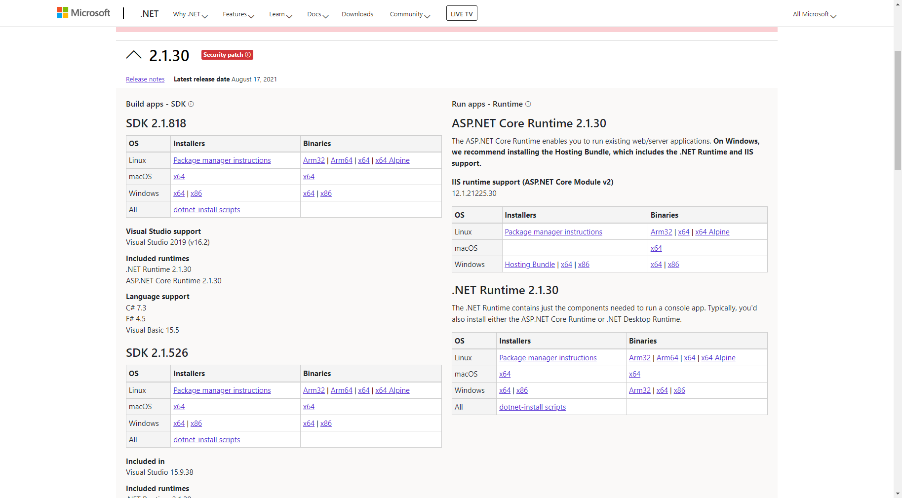

# TMT蛋白组学. 环境配置

对于TMT串联质谱分析，我们这里使用MaxQuant完成对raw文件的处理，同时，我们可以考虑使用服务器来完成处理。这意味着，环境我们既可以选择windows，也可以选择linux，我们首先介绍一下windows环境如何配置

## 1. Windows环境配置

在Windows环境下，我们环境配置分为以下几个步骤：

### 1.1 .Net环境安装

在本教程中，我们使用的MaxQuant对应的版本为1.6.7.10，这个版本要求的.Net框架为2.0。于是，我们从微软官网下载：https://dotnet.microsoft.com/en-us/download/dotnet/2.1 



### 1.2 MaxQuant安装

在windows下，我们只需要将MaxQuant下载下来即可直接使用（装完.net框架后）

下载地址：https://maxquant.net/

## 2. Linux环境下的安装

由于我们有时候会不想用自己的电脑跑，更希望在服务器上运行。在这里，我们使用的是Ubuntu18.04来对蛋白组学数据进行处理。

### 2.1 .Net环境安装

使用 APT 进行安装可通过几个命令来完成。 安装 .NET 之前，请运行以下命令，将 Microsoft 包签名密钥添加到受信任密钥列表，并添加包存储库。

打开终端并运行以下命令：

Bash

```bash
wget https://packages.microsoft.com/config/ubuntu/18.04/packages-microsoft-prod.deb -O packages-microsoft-prod.deb
sudo dpkg -i packages-microsoft-prod.deb
rm packages-microsoft-prod.deb
```

### 2.2 安装 SDK

.NET Core SDK 使你可以通过 .NET Core 开发应用。 如果安装 .NET Core SDK，则无需安装相应的运行时。 若要安装 .NET Core SDK，请运行以下命令：

Bash

```bash
sudo apt-get update; \
  sudo apt-get install -y apt-transport-https && \
  sudo apt-get update && \
  sudo apt-get install -y dotnet-sdk-2.1
```

### 2.3 验证安装

我们在终端输入

```bash
sudo dotnet --version
```

如果显示正确的版本号，那么就意味着安装成功了。