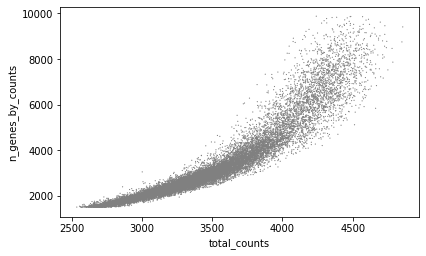
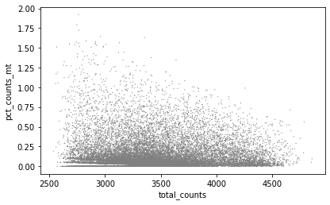
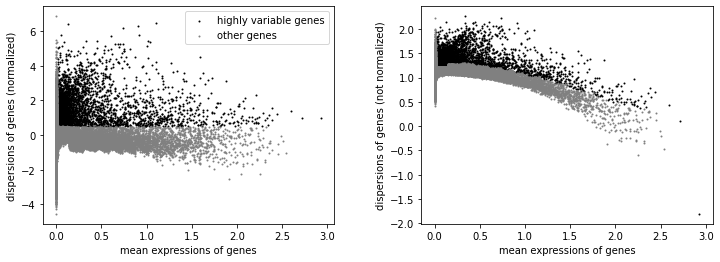

# MOFA分析： scRNA-seq数据处理

由于单细胞原始矩阵较大，我们进行mofa分析时往往需要对scRNA-seq数据进行预处理

## 1. 数据准备

### 1.1 导入包

```python
import anndata
import networkx as nx
import scanpy as sc
from matplotlib import rcParams
import pandas as pd
import numpy as np
```

### 1.2 导入数据

```python
rna_pair = anndata.read_h5ad("rna_pair.h5ad")
#atac_pair = anndata.read_h5ad("atac_pair.h5ad")
new_pair=pd.read_csv('mofa_pre_pair.csv')
```

### 1.3 配对细胞重命名

```python
#new_cell=[]
#for i in rna_pair.obs.index:
#  new_cell.append(new_pair[new_pair['scRNA']==i]['sample'].iloc[0])
#rna_pair.obs.index=new_cell
#new_cell[:5]

r1=rna_pair[new_pair['scRNA']]
r1.obs.index=new_pair.index.values
r1.write_h5ad('rna_mofa_pre1.h5ad',compression="gzip")#必须先保存
rna_pair=anndata.read_h5ad("rna_mofa_pre1.h5ad")

```

## 2. 单细胞数据质控

### 2.1 过滤细胞与基因

```python
sc.pp.filter_cells(rna_pair, min_genes=2000)
sc.pp.filter_genes(rna_pair, min_cells=150)
```

### 2.2 过滤线粒体基因

```python
rna_pair.var['mt'] = rna_pair.var_names.str.startswith('MT-')  # annotate the group of mitochondrial genes as 'mt'
sc.pp.calculate_qc_metrics(rna_pair, qc_vars=['mt'], percent_top=None, log1p=False, inplace=True)
sc.pl.violin(rna_pair, ['n_genes_by_counts', 'total_counts', 'pct_counts_mt'],
             jitter=0.4, multi_panel=True)
```


### 2.3 观察分布

```python
sc.pl.scatter(rna_pair, x='total_counts', y='pct_counts_mt')
sc.pl.scatter(rna_pair, x='total_counts', y='n_genes_by_counts')
```



### 2.4 根据分布过滤细胞

```python
rna_pair = rna_pair[rna_pair.obs.n_genes_by_counts < 3500, :]
rna_pair = rna_pair[rna_pair.obs.pct_counts_mt < 1, :]
```

### 2.5 高变基因计算

```python
sc.pp.normalize_total(rna_pair, target_sum=1e4)
sc.pp.log1p(rna_pair)
sc.pp.highly_variable_genes(rna_pair, min_mean=0.0125, max_mean=3, min_disp=0.5)
sc.pl.highly_variable_genes(rna_pair)
rna_pair = rna_pair[:, rna_pair.var.highly_variable]
```



### 2.6 回归

```python
sc.pp.regress_out(rna_pair, ['total_counts', 'pct_counts_mt'])
sc.pp.scale(rna_pair, max_value=10)
rna_pair.write_h5ad('rna_mofa.h5ad',compression='gzip')
```

