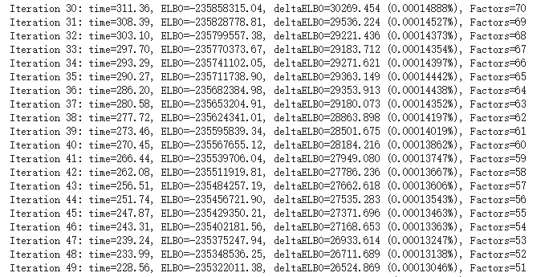

# MOFA分析：MOFA模型构建

到本小节，就正式构建MOFA模型了

## 1. 数据准备

### 1.1 导入包

```python
from mofapy2.run.entry_point import entry_point
import anndata
import networkx as nx
import scanpy as sc
from matplotlib import rcParams
import pandas as pd
import numpy as np
```

### 1.2 导入数据

```python
rna=anndata.read_h5ad("rna_mofa.h5ad")
atac=anndata.read_h5ad("atac_mofa.h5ad")
```

### 1.3 计算多组学公共list

```python
ret3= list(set(rna.obs.index).intersection(atac.obs.index))
```

### 1.4 观察细胞类型

```python
for i in list(set(rna[ret3].obs['cell_type'])):
  print(i,len(rna[ret3].obs.loc[rna[ret3].obs['cell_type']==i])/len(rna[ret3].obs))
```

> OPC 0.046986390149060274 
>
> PER.END 0.0031756318859364873 
>
> ASC 0.07465975372650681 
>
> INH 0.08165910563836681 
>
> MG 0.0390149060272197 
>
> ODC 0.6180816591056384 
>
> EX 0.13642255346727156

## 2. MOFA模型

### 2.1 MOFA参数设置

```python
# initialise the entry point

ent1 = entry_point()
ent1.set_data_options(
    scale_groups = False, 
    scale_views = False,
    center_groups=True,
)
```

### 2.2 构建组学层

```python
data_mat=[[None for g in range(1)] for m in range(2)]
data_mat[0][0]=rna[ret3].X
data_mat[1][0]=np.array(atac[ret3].X.todense())
```

### 2.3 MOFA数据导入

```python
ent1.set_data_matrix(data_mat, likelihoods = ["gaussian","gaussian"],
          views_names=['rna','atac'],
          samples_names=[ret3],
          features_names=[rna[ret3].var_names,atac[ret3].var_names])
```

### 2.4 模型参数设置

```python
ent1.set_model_options(
    factors = 20, 
    spikeslab_weights = True, 
    ard_factors = True,
    ard_weights = True
)
ent1.set_train_options(
    iter = 3000, 
    convergence_mode = "slow", 
    startELBO = 1, 
    freqELBO = 1, 
    dropR2 = 0.001, 
    gpu_mode = True, 
    verbose = False, 
    seed = 1
)
```

### 2.5 模型运行并保存

```python

ent1.build()

ent1.run()

# Save the output
ent1.save(outfile='mofa_factor.hdf5')
```



### 2.6 meta数据导出

```
rna[ret3].obs.to_csv('mofa_meta.csv')
```

