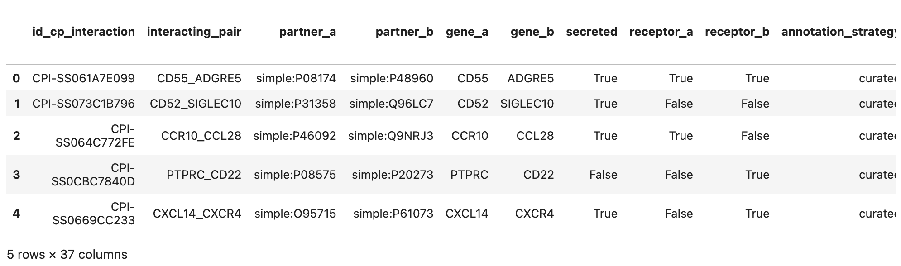
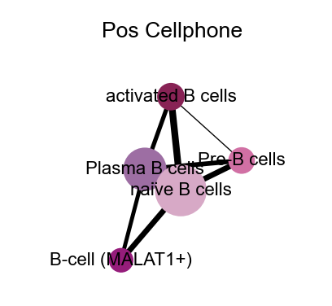
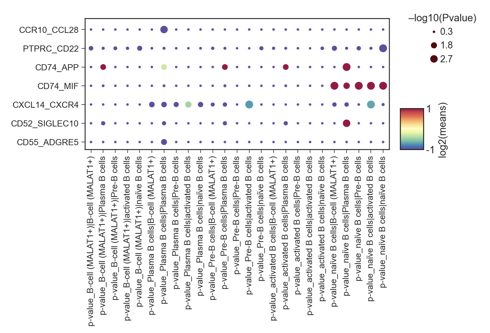
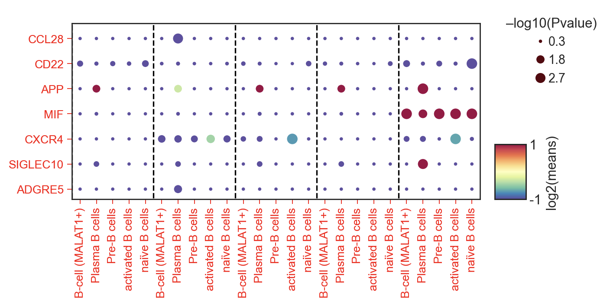
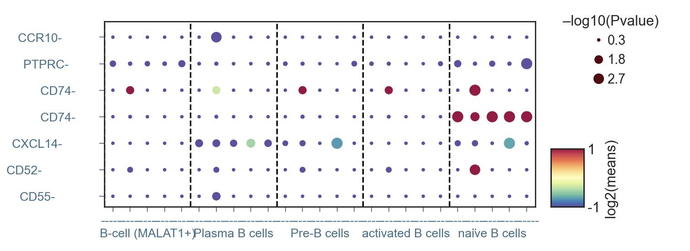

### 4.3 细胞通讯分析

在分析完阳性淋巴结跟阴性淋巴结的差异表达情况后，我们还有一种很直观的思路就是，我们可以比较阳性淋巴结跟阴性淋巴结中，这5种不同的B细胞之间的通讯，是否也发生了相应的变化。

在这里，我们用到的一个新的分析方法，叫做CellphoneDB细胞通讯分析，顾名思义，细胞之间打电话，相关包的介绍我们可以参照官方说明文档，这里不做过多解释，那么，在我们的淋巴结中，该如何应用这个分析呢？

#### 4.3.1 细胞通讯分析数据准备

我们首先还是导入包以及B细胞数据

```python
import numpy as np
import pandas as pd
import scanpy as sc
import anndata
import os
import sys
from scipy import sparse
sc.settings.verbosity = 1  # verbosity: errors (0), warnings (1), info (2), hints (3)

adata=sc.read('B_cell_anno_new.h5ad')
adata
```

在这里，我们将要用到的是原始表达矩阵，也就是没有归一化的数据，所以我们采用GLUE分析中产生的中间文件`rna-emb.h5ad`来做分析，首先是B细胞中的阳性淋巴结

```python
adata_raw=sc.read('../glue_true/rna-emb.h5ad')
adata_raw=adata_raw.raw.to_adata()[adata.obs.index]
adata_raw=adata_raw[adata_raw.obs['Type']=='Pos']

sc.pp.filter_cells(adata_raw, min_genes=200)
sc.pp.filter_genes(adata_raw, min_cells=3)
sc.pp.normalize_total(adata_raw)
adata_raw=anndata.AnnData(adata_raw.X,obs=pd.DataFrame(index=adata_raw.obs.index),
                          var=pd.DataFrame(index=adata_raw.var.index))
adata_raw.write_h5ad('Bcell_pos_raw.h5ad',compression='gzip')
adata_raw.to_df().T.to_csv('Bcell_pos_counts.tsv',sep='\t')


df_meta = pd.DataFrame(data={'Cell':list(adata[adata_raw.obs.index].obs.index),
                             'cell_type':[ i for i in adata[adata_raw.obs.index].obs['B_celltype']]
                            })
df_meta.set_index('Cell', inplace=True)
df_meta.to_csv('Bcell_pos_meta.tsv', sep = '\t')

adata_raw
```

输出结果

```shell
AnnData object with n_obs × n_vars = 2684 × 12951
```

通过运行该代码，我们一共得到了`Bcell_pos_counts.tsv`与`Bcell_pos_meta.tsv`两个文件，同理我们对阴性淋巴结进行相同的数据准备，将得到`Bcell_neg_counts.tsv`与`Bcell_neg_meta.tsv`两个文件。

#### 4.3.2 细胞通讯分析

我们在终端`terminal`中输入以下代码，等待1个小时左右便能得到细胞通讯分析的运行结果了

```shell
cellphonedb method statistical_analysis /content/Bcell_neg_meta.tsv \
/content/Bcell_neg_counts.tsv --output-path /content/Bcell_neg --counts-data hgnc_symbol

cellphonedb method statistical_analysis /content/Bcell_pos_meta.tsv \
/content/Bcell_pos_counts.tsv --output-path /content/Bcell_pos --counts-data hgnc_symbol
```

输出结果

```shell
[ ][CORE][09/10/22-18:07:53][INFO] Initializing SqlAlchemy CellPhoneDB Core
[ ][CORE][09/10/22-18:07:53][INFO] Using custom database at /root/.cpdb/releases/v4.0.0/cellphone.db
[ ][APP][09/10/22-18:07:53][INFO] Launching Method cpdb_statistical_analysis_local_method_launcher
[ ][APP][09/10/22-18:07:53][INFO] Launching Method _set_paths
[ ][APP][09/10/22-18:07:53][INFO] Launching Method _load_meta_counts
[ ][APP][09/10/22-18:08:00][INFO] Launching Method _check_counts_data
[ ][CORE][09/10/22-18:08:00][INFO] Launching Method cpdb_statistical_analysis_launcher
[ ][CORE][09/10/22-18:08:00][INFO] Launching Method _counts_validations
[ ][CORE][09/10/22-18:08:00][INFO] Launching Method get_interactions_genes_complex
[ ][CORE][09/10/22-18:08:00][INFO] [Cluster Statistical Analysis] Threshold:0.1 Iterations:1000 Debug-seed:-1 Threads:4 Precision:3
[ ][CORE][09/10/22-18:08:02][INFO] Running Real Analysis
[ ][CORE][09/10/22-18:08:02][INFO] Running Statistical Analysis
[ ][CORE][09/10/22-18:39:47][INFO] Building Pvalues result
[ ][CORE][09/10/22-18:39:48][INFO] Building results
[ ][CORE][09/10/22-18:39:51][INFO] Initializing SqlAlchemy CellPhoneDB Core
[ ][CORE][09/10/22-18:39:51][INFO] Using custom database at /root/.cpdb/releases/v4.0.0/cellphone.db
[ ][APP][09/10/22-18:39:51][INFO] Launching Method cpdb_statistical_analysis_local_method_launcher
[ ][APP][09/10/22-18:39:51][INFO] Launching Method _set_paths
[ ][APP][09/10/22-18:39:51][INFO] Launching Method _load_meta_counts
[ ][APP][09/10/22-18:39:57][INFO] Launching Method _check_counts_data
[ ][CORE][09/10/22-18:39:57][INFO] Launching Method cpdb_statistical_analysis_launcher
[ ][CORE][09/10/22-18:39:57][INFO] Launching Method _counts_validations
[ ][CORE][09/10/22-18:39:57][INFO] Launching Method get_interactions_genes_complex
[ ][CORE][09/10/22-18:39:57][INFO] [Cluster Statistical Analysis] Threshold:0.1 Iterations:1000 Debug-seed:-1 Threads:4 Precision:3
[ ][CORE][09/10/22-18:39:59][INFO] Running Real Analysis
[ ][CORE][09/10/22-18:39:59][INFO] Running Statistical Analysis
[ ][CORE][09/10/22-19:06:40][INFO] Building Pvalues result
[ ][CORE][09/10/22-19:06:40][INFO] Building results
```

我们将细胞通讯的结果分别存放到了`Bcell_pos`,`Bcell_neg`两个文件夹中，我们这里演示如何对阳性淋巴结(Pos)进行分析

#### 4.3.3 细胞通讯可视化-细胞关系

首先依然是导入基础的包

```python
import pandas as pd
import numpy as np
import networkx as nx
import matplotlib.pyplot as plt
import seaborn as sns
import scanpy as sc

sc.logging.print_header()
sc.settings.set_figure_params(dpi=80, facecolor='white')

sc_color=['#7CBB5F','#368650','#A499CC','#5E4D9A','#78C2ED','#866017','#9F987F', '#E0DFED', '#EF7B77', '#279AD7',
 '#F0EEF0', '#1F577B', '#A56BA7', '#E0A7C8', '#E069A6', '#941456', '#FCBC10', '#EAEFC5', '#01A0A7', '#75C8CC', 
'#F0D7BC', '#D5B26C', '#D5DA48', '#B6B812','#9DC3C3', '#A89C92', '#FEE00C','#FEF2A1']

type_color_B={
    'naïve B cells':sc_color[13],
    'Follicular B cells':sc_color[20],
    'Pre-B cells':sc_color[14],
    'activated B cells':sc_color[15],
    'IgA+ Plasma B cells':sc_color[8],
    'IgG+ Plasma B cells':sc_color[12],
    'Plasma B cells':sc_color[12],
    'B-cell':sc_color[13],
    'B-cell (MALAT1+)':'#a3007d',

}

```

接着我们读取需要用到的文件

```python
sig_means=pd.read_csv('../cellphonedb/Bcell_pos/significant_means.txt',sep='\t')
sig_means.head()
```

<figure markdown>
  { width="300" }
</figure> 

```python
de=pd.read_csv('../cellphonedb/Bcell_pos/deconvoluted.txt',sep='\t')
de.columns[:]
```

输出结果

```shell
Index(['gene_name', 'uniprot', 'is_complex', 'protein_name', 'complex_name',
       'id_cp_interaction', 'B-cell (MALAT1+)', 'Plasma B cells',
       'Pre-B cells', 'activated B cells', 'naïve B cells'],
      dtype='object')
```

构建细胞通讯网络

```python
G=nx.Graph()
for name in de.columns[6:]:
    test=sig_means.loc[:,sig_means.columns.str.contains('\|')].sum()
    for i in test.index:
        if test.loc[i]!=0:
            a=i.split('|')
            G.add_edge(a[0],a[1],weight=test.loc[i])

fig, ax = plt.subplots(figsize=(3,3)) 

nodes=[]
G_degree=dict(G.degree(G.nodes()))


G_nodes_dict={}
links = []
for i in G.edges:
    if i[0] not in G_nodes_dict.keys():
        G_nodes_dict[i[0]]=0
    if i[1] not in G_nodes_dict.keys():
        G_nodes_dict[i[1]]=0
    links.append({"source": i[0], "target": i[1]})
    weight=G.get_edge_data(i[0],i[1])['weight']
    G_nodes_dict[i[0]]+=weight
    G_nodes_dict[i[1]]+=weight


pos = nx.spring_layout(G)
p=dict(G.nodes)
nodesize=[G_nodes_dict[u]*30 for u in G.nodes()]
nodecolos=[type_color_B[u] for u in G.nodes()]
nx.draw_networkx_nodes(G, pos, nodelist=p,node_size=nodesize,node_color=nodecolos)#cmap=nodecmap,
                       #node_color=list(p.values()))

edgewidth = [G.get_edge_data(u, v)['weight'] for u, v in G.edges()]
nx.draw_networkx_edges(G, pos,width=edgewidth)


#label_options = {"ec": "white", "fc": "white", "alpha": 0.6}
nx.draw_networkx_labels(G, pos, font_size=10,) #bbox=label_options)
plt.grid(False)
plt.axis("off")
plt.xlim(-2,2)
plt.ylim(-2,1.5)
plt.title('Pos Cellphone',fontsize=12)
#plt.savefig("cellphonedb/pos_cellphone.png",dpi=300,bbox_inches = 'tight')
```

<figure markdown>
  { width="300" }
</figure> 
#### 4.3.4 细胞通讯可视化-受配体关系

首先依然是导入数据

```python
sig_means1=sig_means.copy()
sig_means1.set_index(sig_means1.columns[1],inplace=True)

pvalue=pd.read_csv('../cellphonedb/Bcell_pos/pvalues.txt',sep='\t')
pvalue.set_index(pvalue.columns[1],inplace=True)
p=pvalue.loc[:,pvalue.columns.str.contains('')]
p.head()

exp=sig_means1.loc[:,sig_means1.columns.str.contains('\|')]
exp.head()
```

紧接着，我们生成需要展示的受配体DataFrame

```python
plot_data3=pd.DataFrame(columns=['Pair','means','p-value','Type'])
p_pair=exp.columns.tolist()
for i in list(set(exp.index.tolist())):
    plot_data4=pd.DataFrame()
    if exp.loc[i,p_pair].fillna(0).sum()==0:
        continue
    plot_data4['Pair']=[j for j in [i]*len(p_pair)]
    plot_data4['means']=exp.loc[i,p_pair].values
    plot_data4['p-value']=-np.log10(p.loc[i,p_pair].values.astype('float'))+0.3
    plot_data4['Type']=p_pair
    
    plot_data3=pd.concat([plot_data3,plot_data4])
plot_data3=plot_data3.fillna(0)

plot_data3['means']=np.log2(plot_data3['means'])
plot_data3=plot_data3.replace(float('inf'),3)
plot_data3=plot_data3.replace(float('-inf'),-3)
plot_data3.head()
```

| Pair |       means | p-value | Type |                                     |
| ---: | ----------: | ------: | ---: | ----------------------------------- |
|    0 | CCR10_CCL28 |    -3.0 |  0.3 | B-cell (MALAT1+)\|B-cell (MALAT1+)  |
|    1 | CCR10_CCL28 |    -3.0 |  0.3 | B-cell (MALAT1+)\|Plasma B cells    |
|    2 | CCR10_CCL28 |    -3.0 |  0.3 | B-cell (MALAT1+)\|Pre-B cells       |
|    3 | CCR10_CCL28 |    -3.0 |  0.3 | B-cell (MALAT1+)\|activated B cells |
|    4 | CCR10_CCL28 |    -3.0 |  0.3 | B-cell (MALAT1+)\|naïve B cells     |

基础绘图

```python
#pip install python_dotplot
import dotplot
import dotplot.utils
new_keys = {'item_key': 'Pair','group_key': 'Type','sizes_key': 'p-value','color_key': 'means'}
dp = dotplot.DotPlot.parse_from_tidy_data(plot_data3, **new_keys)
ax = dp.plot(size_factor=40, cmap='Spectral_r',
             dot_title = '–log10(Pvalue)', colorbar_title = 'log2(means)',vmin=-1,vmax=1)

xlabs=ax.get_axes()[0].get_xticklabels()
ax.get_axes()[0].set_xticklabels(xlabs,fontsize=12)
ylabs=ax.get_axes()[0].get_yticklabels()
ax.get_axes()[0].set_yticklabels(ylabs,fontsize=12)
```

<figure markdown>
  { width="300" }
</figure> 

这图看起来不是很美观，我们稍微美化一下，将生成两张图，最后再用PS合并，首先是受体图

```python
#去除配体
[i.set_text(i.get_text().split('|')[1].replace('Vil-','')) for i in xlabs]
ax.get_axes()[0].set_xticklabels(xlabs,fontsize=12)
#绘制虚线
[i.set_text(i.get_text().split('_')[1]) for i in ylabs]
ax.get_axes()[0].set_yticklabels(ylabs,fontsize=12)
for i in range(len(xlabs)):
    if i%5==0:
        ax.get_axes()[0].axvline(x=i+0.5, ymin=-1, ymax=10,color='black',linestyle="--")
#上色        
ax.get_axes()[0].tick_params(axis='both',colors='red', which='both')
ax.savefig("cellphonedb/figure_pos_rec.png",dpi=300,bbox_inches = 'tight')
ax
```

<figure markdown>
  { width="300" }
</figure> 

其次是配体图

```python
new_keys = {'item_key': 'Pair','group_key': 'Type','sizes_key': 'p-value','color_key': 'means'}
dp = dotplot.DotPlot.parse_from_tidy_data(plot_data3, **new_keys)
ax = dp.plot(size_factor=40, cmap='Spectral_r',
             dot_title = '–log10(Pvalue)', colorbar_title = 'log2(means)',vmin=-1,vmax=1)

xlabs=ax.get_axes()[0].get_xticklabels()
ax.get_axes()[0].set_xticklabels(xlabs,fontsize=12)
ylabs=ax.get_axes()[0].get_yticklabels()
ax.get_axes()[0].set_yticklabels(ylabs,fontsize=12)
#去除受体
[xlabs[i].set_text('------') for i in range(len(xlabs)) if (i+3)%5!=0]
[xlabs[i].set_text('------\n'+xlabs[i].get_text().replace('p-value_','').split('|')[0]) for i in range(len(xlabs)) if (i+3)%5==0]
ax.get_axes()[0].set_xticklabels(xlabs,fontsize=12,rotation=0)
#绘制虚线
[i.set_text(i.get_text().split('_')[0]+'-'+'  '*len(i.get_text().split('_')[1])) for i in ylabs]
ax.get_axes()[0].set_yticklabels(ylabs,fontsize=12)

for i in range(len(xlabs)):
    if i%5==0:
        ax.get_axes()[0].axvline(x=i+0.5, ymin=-1, ymax=10,color='black',linestyle="--")
#上色
ax.get_axes()[0].tick_params(axis='both',colors='#3C718D', which='major')
ax.savefig("cellphonedb/figure_pos_li.png",dpi=300,bbox_inches = 'tight')
ax

```

<figure markdown>
  { width="300" }
</figure> 