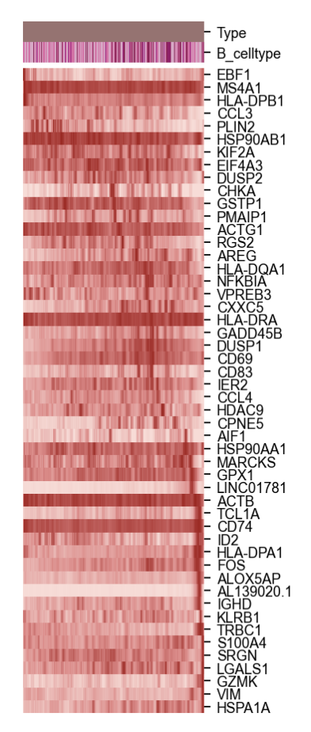
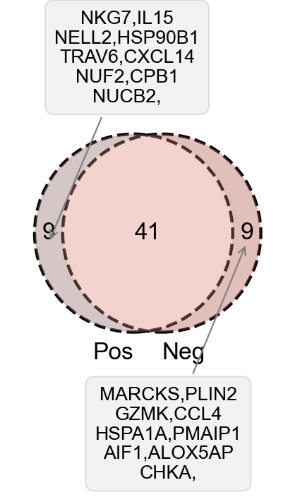

### 4.4 动态调控过程

在比较完阳性淋巴结跟阴性淋巴结的差异表达，细胞通讯情况后，我们会直观地想到，我们前面绘制出了B细胞的分化过程，阳性淋巴结跟阴性淋巴结的这个过程是不是应该也有一定的区别呢？我们是否可以找出这个动态调控的关系？

于是，我们在本小节就比较两种淋巴结的动态调控关系

首先，依然是包的导入

```python
#导入包
import anndata
print('anndata(Ver): ',anndata.__version__)
import scanpy as sc
print('scanpy(Ver): ',sc.__version__)
import scltnn #非必需
print('scltnn(Ver): ',scltnn.__version__)
import matplotlib.pyplot as plt
import matplotlib
print('matplotlib(Ver): ',matplotlib.__version__)
import seaborn as sns
print('seaborn(Ver): ',sns.__version__)
import numpy as np
print('numpy(Ver): ',np.__version__)
import pandas as pd
print('pandas(Ver): ',pd.__version__)
import scvelo as scv
print('scvelo(Ver): ',scv.__version__)
import Pyomic
print('Pyomic(Ver): ',Pyomic.__version__)

#绘图参数设置
sc.settings.verbosity = 3             # verbosity: errors (0), warnings (1), info (2), hints (3)
sc.settings.set_figure_params(dpi=80, facecolor='white')

sc_color=['#7CBB5F','#368650','#A499CC','#5E4D9A','#78C2ED','#866017','#9F987F', '#E0DFED', '#EF7B77', '#279AD7',
 '#F0EEF0', '#1F577B', '#A56BA7', '#E0A7C8', '#E069A6', '#941456', '#FCBC10', '#EAEFC5', '#01A0A7', '#75C8CC', 
'#F0D7BC', '#D5B26C', '#D5DA48', '#B6B812','#9DC3C3', '#A89C92', '#FEE00C','#FEF2A1']

def adata_rename(adata,pair,omic_name='omic_1'):
    ret=list(set(pair[omic_name].values) & set(adata.obs.index))
    new_pair=pair.loc[pair[omic_name].isin(ret)]
    adata=adata[new_pair[omic_name].values]
    adata.obs.index=new_pair.index
    return adata
```

在这里，我们对数据的导入进行了一些预处理，我们删掉了一些预先计算好的velocity特征

```python
rna=sc.read('B_cell_anno_new.h5ad')
del rna.var['fit_alpha']
del rna.var['fit_beta']
del rna.var['fit_gamma']
del rna.var['fit_t_']
del rna.var['fit_scaling']
del rna.var['fit_likelihood']
del rna.var['fit_alignment_scaling']

res_pair=pd.read_csv('../multi_omics/res_pair.csv')
res_pair.set_index(res_pair.columns[0],inplace=True)
res_pair.head()

rna=adata_rename(rna,res_pair,'omic_1')
rna
```

随后，我们分别将阳性淋巴结与阴性淋巴结提取出来

```python
rna_pos=rna[rna.obs['Type']=='Pos']
rna_neg=rna[rna.obs['Type']=='Neg']
```

类似的，我们分别重构了阳性淋巴结与阴性淋巴结中的RNA velocity模型

```python
scv.pp.moments(rna_pos, n_pcs=30, n_neighbors=30)
scv.tl.recover_dynamics(rna_pos,n_jobs=4)
scv.tl.latent_time(rna_pos)

scv.pp.moments(rna_neg, n_pcs=30, n_neighbors=30)
scv.tl.recover_dynamics(rna_neg,n_jobs=4)
scv.tl.latent_time(rna_neg)
```

输出结果

```shell
computing neighbors
    finished (0:00:00) --> added 
    'distances' and 'connectivities', weighted adjacency matrices (adata.obsp)
computing moments based on connectivities
    finished (0:00:00) --> added 
    'Ms' and 'Mu', moments of un/spliced abundances (adata.layers)
recovering dynamics (using 4/8 cores)
Error displaying widget: model not found
    finished (0:00:03) --> added 
    'fit_pars', fitted parameters for splicing dynamics (adata.var)
computing latent time using root_cells as prior
    finished (0:00:00) --> added 
    'latent_time', shared time (adata.obs)
```

我们对阳性淋巴结与阴性淋巴结分别可视化调控过程相关的基因

```python
#色卡
from colormap import Colormap
c = Colormap()
rnacmap = c.cmap_linear( '#fcdbd6','#e88989','#a51616')
```

```python
#阴性淋巴结

top_genes_neg = rna_neg.var['fit_likelihood'].sort_values(ascending=False).index[:50]
a=scv.pl.heatmap(rna_neg, var_names=top_genes_neg, sortby='latent_time', col_color=['Type','B_celltype'],
               n_convolve=30,figsize=(3,6),yticklabels=True,show=False,color_map=rnacmap)
a.ax_heatmap.yaxis.set_tick_params(labelsize=8)
a.ax_col_colors.yaxis.set_ticks([0.5,1.5],['Type','B_celltype'],ha='left')
a.ax_col_colors.yaxis.tick_right()
labels=a.ax_col_colors.yaxis.get_ticklabels()
plt.setp(labels, fontsize=8)
plt.savefig("time/time_neg.png",dpi=300,bbox_inches = 'tight')
```


<figure markdown>
  { width="300" }
</figure> 

```python
#阳性淋巴结
top_genes_pos = rna_pos.var['fit_likelihood'].sort_values(ascending=False).index[:50]
a=scv.pl.heatmap(rna_pos, var_names=top_genes_neg, sortby='latent_time', col_color=['Type','B_celltype'],
               n_convolve=30,figsize=(3,6),yticklabels=True,show=False,color_map=rnacmap)
a.ax_heatmap.yaxis.set_tick_params(labelsize=8)
a.ax_col_colors.yaxis.set_ticks([0.5,1.5],['Type','B_celltype'],ha='left')
a.ax_col_colors.yaxis.tick_right()
labels=a.ax_col_colors.yaxis.get_ticklabels()
plt.setp(labels, fontsize=8)
plt.savefig("time/time_pos.png",dpi=300,bbox_inches = 'tight')
```

<figure markdown>
  { width="300" }
</figure> 

热图其实并不直观看见差异，但能看见基因具体处于动态调控的哪个位置，所以我们使用Venn图更为直观看见差异的基因,我们先计算了差异基因的list

```python
ret_top_genes=list(set(top_genes_pos) & set(top_genes_neg))
ret_top_genes_pos=list(set(top_genes_pos) - set(top_genes_neg))
ret_top_genes_neg=list(set(top_genes_neg) - set(top_genes_pos))
len(ret_top_genes),len(ret_top_genes_pos),len(ret_top_genes_neg)
```

同时定义了一个新的函数用于Venn图annotate的文本优化

```python
def plot_str_change(gene_name,num=5):
    genes=str(gene_name).replace("'",'').replace('[','').replace(']','').replace(' ','').split(',')
    res=''
    t=1
    for i in genes:
        if t%num==0:
            res+=i+'\n'
        else:
            res+=i+','
        t+=1
    return res
```

我们绘制出了最后的Venn效果图

```python
from matplotlib_venn import venn2,venn2_circles
#a=ad_factor2_asc.loc[(ad_factor2_asc['sig']=='+') & (ad_factor2_asc['abs_weights']>0.5)]
#b=ctrl_factor1_asc.loc[(ctrl_factor1_asc['sig']=='+') & (ctrl_factor1_asc['abs_weights']>0.5)]
fig, ax = plt.subplots(figsize=(3,6))         # Sample figsize in inches
venn2_circles(subsets=[set(top_genes_pos),set(top_genes_neg)],
        linestyle='--', linewidth=2, color="black",#外框线型、线宽、颜色
        normalize_to=1.0,
       )
v=venn2(subsets=[set(top_genes_pos),set(top_genes_neg)],
      set_labels=('Pos','Neg'),
      set_colors=(type_color['Pos'],type_color['Neg']),
       normalize_to=1.0,)

v.get_label_by_id('10').set_fontsize(15)#1的大小设置为20
v.get_label_by_id('01').set_fontsize(15)#1的大小设置为20
v.get_label_by_id('11').set_fontsize(15)#1的大小设置为20
for t in v.set_labels: 
    t.set_fontsize(15) 


#gene_name=list(set(rna_ad_asc) & set(rna_ctrl_asc))  
#rnk_gene_ad=list(set(rna_ad_asc)-set(rna_ctrl_asc))
#rnk_gene_ctrl=list(set(rna_ctrl_asc)-set(rna_ad_asc))
#rnk_gene_jiao=list(set(rna_ad_asc) | set(rna_ctrl_asc))

#plt.annotate(str(gene_name).replace('flag1','\n').replace("'",'').replace('[','').replace(']',''), xy=v.get_label_by_id('11').get_position() - np.array([0, 0.05]), xytext=(0,-100),
#             ha='center', textcoords='offset points', bbox=dict(boxstyle='round,pad=0.5', fc='gray', alpha=0.1),
#             arrowprops=dict(arrowstyle='->', color='gray'),size=12)

plt.annotate(plot_str_change(ret_top_genes_pos,num=2), xy=v.get_label_by_id('10').get_position() - np.array([0, 0.05]), xytext=(50,90),
             ha='center', textcoords='offset points', bbox=dict(boxstyle='round,pad=0.5', fc='gray', alpha=0.1),
             arrowprops=dict(arrowstyle='->', color='gray'),size=12)

plt.annotate(plot_str_change(ret_top_genes_neg,num=2), xy=v.get_label_by_id('01').get_position() - np.array([0, 0.05]), xytext=(-50,-150),
             ha='center', textcoords='offset points', bbox=dict(boxstyle='round,pad=0.5', fc='gray', alpha=0.1),
             arrowprops=dict(arrowstyle='->', color='gray'),size=12)
plt.savefig("time/time_pos_neg_venn.png",dpi=300,bbox_inches = 'tight')
#plt.savefig("asc_venn.png",dpi=300,bbox_inches = 'tight')
```

<figure markdown>
  { width="300" }
</figure> 