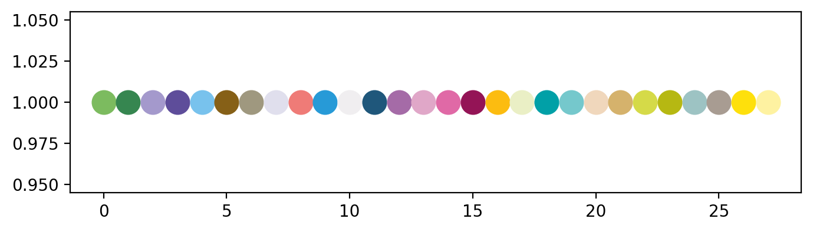
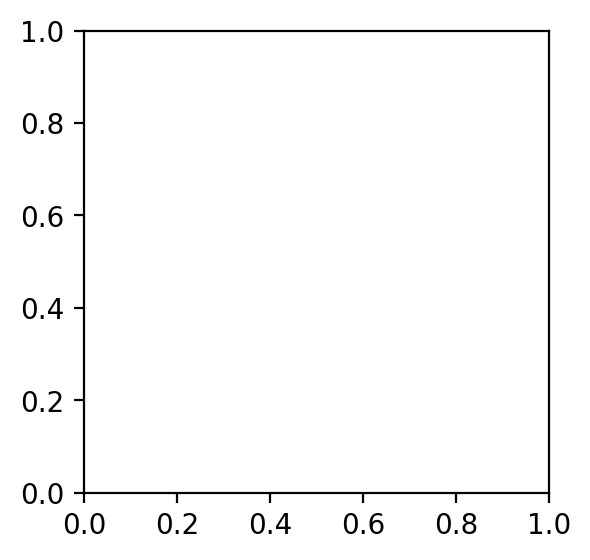
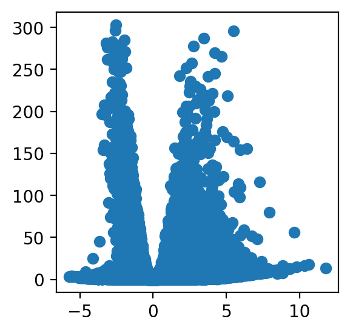
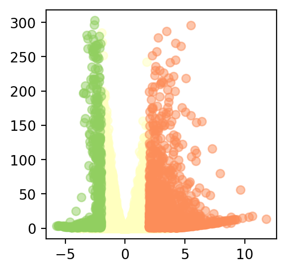
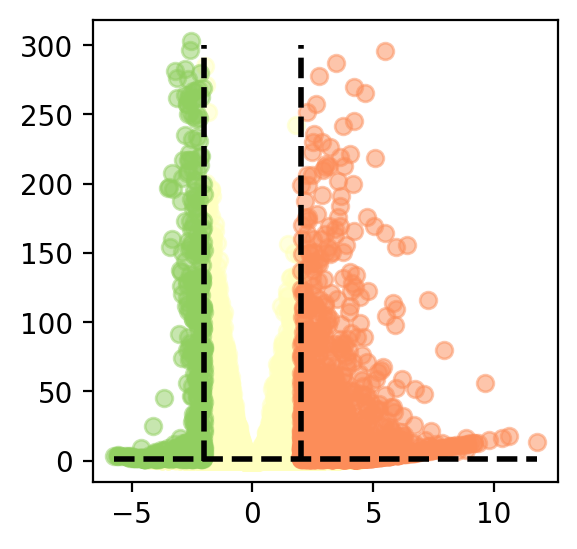
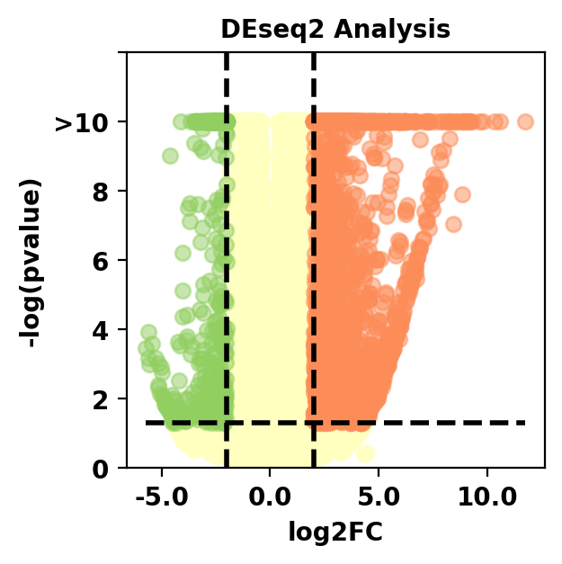
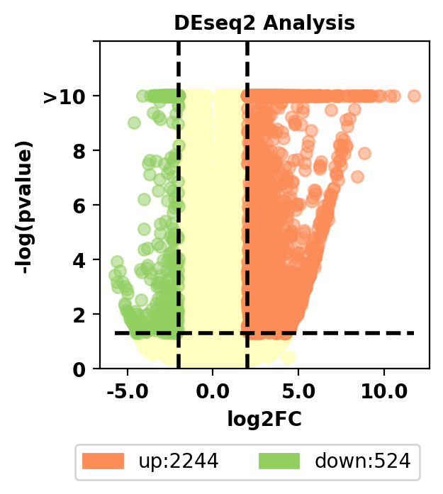
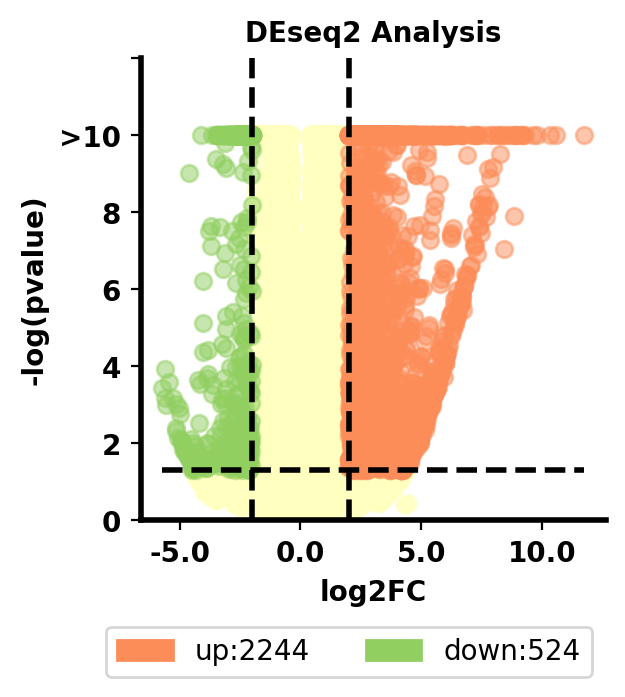
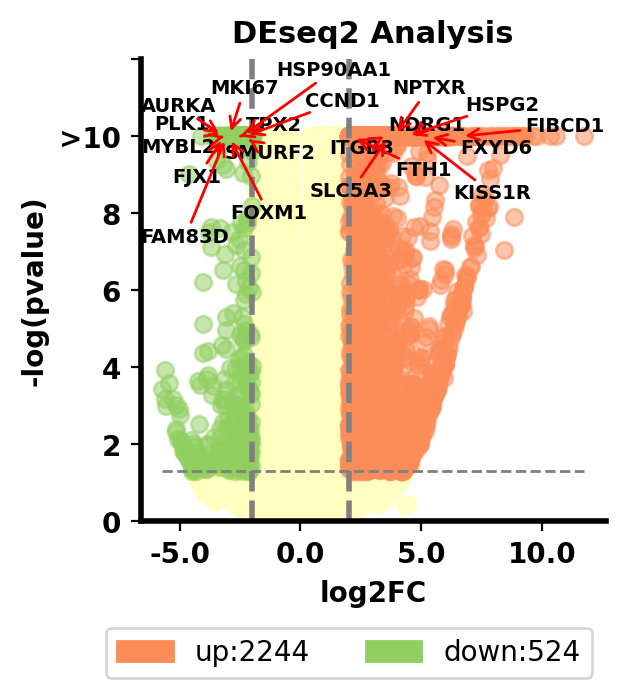

# Python数据可视化——生物信息学专栏


## 1. 火山图（散点图）

首先带来的第一个图是火山图，为什么要叫火山图呢，实际上只是因为形状有一点像火山喷发，所以被人们这么命名，在本期的教程，我将Python中matplotlib的语法贯穿其中，不讲概念，希望大家能有所收获

**数据下载地址：https://github.com/Starlitnightly/bioinformatic_tutorial/tree/main/PLOT/data/data_vol.csv**

### 1.1 画图配置

我们首先配置一下jupyter的显示效果，这里用了retina作为显示的图片格式，其次导入了一些常见的包，并提供了一个色卡


```python
%matplotlib inline
%config InlineBackend.figure_format = 'retina'

#导入包，我有一个习惯就是把导入的包的版本号同时打印出来，这样别人出问题的时候，也能知道到底是哪个版本没对上
import matplotlib.pyplot as plt
import matplotlib
from matplotlib.colors import LinearSegmentedColormap
import matplotlib.patches as mpatches
print('matplotlib(Ver): ',matplotlib.__version__)

import seaborn as sns
print('seaborn(Ver): ',sns.__version__)

import numpy as np
print('numpy(Ver): ',np.__version__)

import pandas as pd
print('pandas(Ver): ',pd.__version__)

#色卡，这里提供一个我画图常用的色卡，我一般画图的颜色都是从里面选取的
sc_color=['#7CBB5F','#368650','#A499CC','#5E4D9A','#78C2ED','#866017', '#9F987F','#E0DFED',
 '#EF7B77', '#279AD7','#F0EEF0', '#1F577B', '#A56BA7', '#E0A7C8', '#E069A6', '#941456', '#FCBC10',
 '#EAEFC5', '#01A0A7', '#75C8CC', '#F0D7BC', '#D5B26C', '#D5DA48', '#B6B812', '#9DC3C3', '#A89C92', '#FEE00C', '#FEF2A1']
plt.figure(figsize=(8, 2))
for i in range(len(sc_color)):
    plt.scatter(i, 1, c=sc_color[i], s=200)
plt.show()

```

    matplotlib(Ver):  3.5.1
    seaborn(Ver):  0.11.2
    numpy(Ver):  1.23.4
    pandas(Ver):  1.5.1



    


### 1.2 导入数据

在这里，我们导入了绘制火山图需要的数据，并对数据进行了一些初步的预处理，比如对数化，使其能满足我们的需求。

我们导入的数据是来自DEseq2包分析的结果。


```python
#设置文件路径
current_path='/home/xiongyy/analysis/PLOT/'
#使用read_csv导入csv文件
data=pd.read_csv(current_path+'data/data_vol.csv')
#设置表头,`inplace=True`代表替换原文件
data.set_index(data.columns[0],inplace=True)
#设置index的名字，设不设都行，就是unamed:0看着怪怪的
data.index.names=['genes']
#计算p-value的对数化，并取负值，取负数是因为我们关心的事p<0.05的部分，所以这部分对数化后是负数，我们再取一个负数就变正数了
data['log(padj)'] = -np.log10(data['padj'])
#我们将｜log2FoldChange｜大于2跟padj小于0.05的基因都标注一下，这部分基因就是我们感兴趣的了
data['sig'] = 'normal'
data.loc[(data.log2FoldChange> 2 )&(data.padj < 0.05),'sig'] = 'up'
data.loc[(data.log2FoldChange< -2 )&(data.padj < 0.05),'sig'] = 'down'

data.head()
```

    /home/xiongyy/miniconda3/envs/bio/lib/python3.8/site-packages/pandas/core/arraylike.py:402: RuntimeWarning: divide by zero encountered in log10
      result = getattr(ufunc, method)(*inputs, **kwargs)

<div>
<style scoped>
    .dataframe tbody tr th:only-of-type {
        vertical-align: middle;
    }


    .dataframe tbody tr th {
        vertical-align: top;
    }
    
    .dataframe thead th {
        text-align: right;
    }

</style>

<table border="1" class="dataframe">
  <thead>
    <tr style="text-align: right;">
      <th></th>
      <th>baseMean</th>
      <th>log2FoldChange</th>
      <th>lfcSE</th>
      <th>stat</th>
      <th>pvalue</th>
      <th>padj</th>
      <th>log(padj)</th>
      <th>sig</th>
    </tr>
    <tr>
      <th>genes</th>
      <th></th>
      <th></th>
      <th></th>
      <th></th>
      <th></th>
      <th></th>
      <th></th>
      <th></th>
    </tr>
  </thead>
  <tbody>
    <tr>
      <th>HSPG2</th>
      <td>2381.469193</td>
      <td>4.375009</td>
      <td>0.100647</td>
      <td>43.469063</td>
      <td>0.0</td>
      <td>0.0</td>
      <td>inf</td>
      <td>up</td>
    </tr>
    <tr>
      <th>KIF2C</th>
      <td>2566.497532</td>
      <td>-2.668326</td>
      <td>0.070670</td>
      <td>-37.757773</td>
      <td>0.0</td>
      <td>0.0</td>
      <td>inf</td>
      <td>down</td>
    </tr>
    <tr>
      <th>CCN1</th>
      <td>7205.494206</td>
      <td>-3.445651</td>
      <td>0.061146</td>
      <td>-56.350780</td>
      <td>0.0</td>
      <td>0.0</td>
      <td>inf</td>
      <td>down</td>
    </tr>
    <tr>
      <th>ATP1B1</th>
      <td>5993.319741</td>
      <td>3.305873</td>
      <td>0.066467</td>
      <td>49.737038</td>
      <td>0.0</td>
      <td>0.0</td>
      <td>inf</td>
      <td>up</td>
    </tr>
    <tr>
      <th>STEAP3</th>
      <td>5283.907094</td>
      <td>2.597059</td>
      <td>0.061520</td>
      <td>42.214808</td>
      <td>0.0</td>
      <td>0.0</td>
      <td>inf</td>
      <td>up</td>
    </tr>
  </tbody>
</table>

</div>


观察数据我们发现，有很多`inf`，inf代表无限的意思，这也很好理解，我们对0取对数就是负无限，那么取反就是正无限。
一般来说，我们会对log(padj)大于10的，都视作非常非常显著了，所以我们最后画图的时候会稍微卡一下阈值。
这里需要跟大家解释一下什么叫`log2FoldChange`，什么叫`padj`。这是两个很简单，但也很有意思的概念。

首先是`log2FoldChange`，我们在生物学分析中，需要衡量一个基因在两个不同的组，通常认为是`实验组`与`对照组`的变化，
如果一个基因在实验组表达要明显升高，那么这个基因可能就是我们感兴趣的基因，我们用以下的计算公式：
$$
log2FoldChange= \log_{2}{\frac{Avg(Gene-expression_{实验组})}{ \ {Avg(Gene-expression_{对照组}})}}
$$
其中Avg代表平均表达量，那么我们很容易推出，如果log2FoldChange大于1的话，也就是实验组的平均表达是对照组的两倍，大于2就是四倍，以此类推，
很自然而然的我们就会想到，log2FC可以作为一个阈值来筛选表达升高的基因，跟表达下降的基因。但是，这个筛选一定准确吗？答案是否定的，为什么？
这里有一个很简单的例子，假如我Gene1在实验组的两个样本的表达分别为1、40；在对照组的两个样本的表达分别为15、15，那么实验组的平均值是20.5，对照组的平均值是15，
我们能简单地判定Gene1在实验组中表达上调吗？答案当然是否定的。

于是我们这里引入了统计学检验t-test，利用统计学检验我们进行了一个零假设：我们假设Gene1在实验组跟对照组没有差别，然后对这个假设进行检验，
假如我们发现，p-value小于0.05，意味着这个零假设成立的可能只有5%。很自然地我们就会想到，实验组跟对照组有差别的可能性为95%。读到这里你可能会问，
为什么我不直接假设Gene1在实验组跟对照组有差别，事实上这个思路没错，但是不好检验，如果假设没有差别我们就可以把两个数据当一个数据来检验就很好下判断了。
因此，我们一般把p-value<0.05作为统计学检验的一个标准。

读到这里，聪明的你发现，我们这里用的是padj，这个跟p-value有什么区别呢？这个叫做多重假设检验。为什么要这么做呢？这是因为我们p-value是存在假阳性的，
假如我这里有100个基因，假设我们检验后有10个基因是p-value小于0.05的，我们犯错误的数量为10*0.05，大概就只有0.5个基因是有问题的，这个是可以容忍的，
读到这里你可能会好奇，为什么是0.5个基因，答案很简单，统计学误差，我们设置的阈值是0.05，意味着我这10个基因并不是一定准确的，里面也是有可能出错的。

但是我如果有10000个基因进行检验呢？我们假设有1000个基因的p-value是小于0.05的，我们判断错的基因的数量为50个，这个数量就比较不能忽视了，所以我们这里引入
多重假设检验来弥补这个误差，那么意味着我10000个基因里只要50个基因，这50个基因是满足我padj小于0.05的。当然多重假设检验是一种方法，还有Bonferroni校正等。

### 1.3 基本火山图绘制

#### 1.3.1 定义画板

这个定义画板就很有意思了，在本系列教程中，尽量避免使用你们熟悉的plt，使用ax进行绘制，目的是能最大化自定义图形的内容。

首先得讲一下`fig`跟`ax`分别都是什么:

- `fig`:

Figure，就是图的外框，也叫画布，可以包括1-无穷个内框Axes

- `ax`:

Axes，就是图的内框，里面可以画各种图

- `plt`:

plt就是一整张画布，它甚至不需要这些组件，想添加什么，直接写就写了，但是用plt画图，在修改细节的时候不太友好


```python
#定义画板，我们定义了一个3x3大小的子图
fig, ax = plt.subplots(figsize=(3,3))
```
<figure markdown>
  { width="300" }
</figure>


#### 1.3.2 绘制基本的散点

我们这里使用ax绘制一下整幅散点图


```python
#绘制散点图,x轴为log2FC，y轴为-log10(padj)
ax.scatter(x=data['log2FoldChange'],
            y=data['log(padj)'],)
```


    <matplotlib.collections.PathCollection at 0x7efd73e1caf0>


<figure markdown>
  { width="300" }
</figure>


#### 1.3.3 为不同类型的散点上色

我们这里有三种基因，分别是上调基因，下调基因，以及正常基因，我们分别为不同的基因上不同的色


```python
fig, ax = plt.subplots(figsize=(3,3))
#首先绘制正常基因
ax.scatter(x=data[data['sig']=='normal']['log2FoldChange'],
           y=data[data['sig']=='normal']['log(padj)'],
           color='#FFFFBF',#颜色
           alpha=.5,#透明度
           )
#接着绘制上调基因
ax.scatter(x=data[data['sig']=='up']['log2FoldChange'],
           y=data[data['sig']=='up']['log(padj)'],
           color='#FC8D59',#选择色卡第15个颜色
           alpha=.5,#透明度
           )
#绘制下调基因
ax.scatter(x=data[data['sig']=='down']['log2FoldChange'],
           y=data[data['sig']=='down']['log(padj)'],
           color='#91CF60',#颜色
           alpha=.5,#透明度
           )
```


    <matplotlib.collections.PathCollection at 0x7efd72c554f0>


<figure markdown>
  { width="300" }
</figure>  


#### 1.3.4 绘制辅助线

在1.3.3中，我们已经得到火山图基本的样貌了，但这并不是我们最终的目的，我们最终画出来的图应该更好看，于是，我们要为火山图添加一些标注
我们一共卡了三根阈值线，分别是log2FC>2,log2FC<-2,padj<0.05，我们在图中将这三根线画出来


```python

ax.plot([data['log2FoldChange'].min(),data['log2FoldChange'].max()],#辅助线的x值起点与终点
        [-np.log10(0.05),-np.log10(0.05)],#辅助线的y值起点与终点
        linewidth=2,#辅助线的宽度
        linestyle="--",#辅助线类型：虚线
        color='black'#辅助线的颜色
        )
ax.plot([2,2],
        [data['log(padj)'].min(),300],
        linewidth=2, 
        linestyle="--",
        color='black')
ax.plot([-2,-2],
        [data['log(padj)'].min(),300],
        linewidth=2, 
        linestyle="--",
        color='black')

```


    [<matplotlib.lines.Line2D at 0x7efd6bf32460>]


<figure markdown>
  { width="300" }
</figure>    


#### 1.3.5 绘制刻度与标签

在得到火山图的雏形后，我们需要对火山图的一些内容进行说明，比如横坐标与纵坐标的含义，比如我们p-value的对数只需要显示到10


```python
#大于10的缩放
data.loc[data['log(padj)']>10,'log(padj)']=10
```


```python
#更改y坐标轴内容，使其只显示到10，并且稍微延长一些
ax.set_yticks([0,2,4,6,8,10,12],#要修改的y坐标轴目标
              ['0','2','4','6','8','>10',''],#要修改的y坐标轴内容
              fontsize=10,
              fontweight='bold'
           )
ax.set_ylim(0,12)
#更改x坐标轴的字体
ax.set_xticks(ax.get_xticks()[1:-1],#获取x坐标轴内容
              ax.get_xticks()[1:-1],#更新x坐标轴内容
              fontsize=10,
              fontweight='bold'
              )
#字体类型定义
font1={
    'weight':'bold',
    'size':10,
}
#设置横标签与纵标签
ax.set_ylabel('-log(pvalue)',font1)                                    
ax.set_xlabel('log2FC',font1)
#设置标题
ax.set_title('DEseq2 Analysis',font1)

```


    Text(0.5, 1.0, 'DEseq2 Analysis')


<figure markdown>
  { width="300" }
</figure>    


#### 1.3.6 绘制图注

虽然我们很清晰图上什么颜色代表什么类型的基因，但是读者并不清楚，所以为了让读者明白我们在干啥，所以这里我们为我们的火山图加上图注


```python
#绘制图注
#legend标签列表，上面的color即是颜色列表
labels = ['up:{0}'.format(len(data[data['sig']=='up'])),
          'down:{0}'.format(len(data[data['sig']=='down']))]  
#用label和color列表生成mpatches.Patch对象，它将作为句柄来生成legend
color = ['#FC8D59','#91CF60']
patches = [mpatches.Patch(color=color[i], label="{:s}".format(labels[i]) ) for i in range(len(color))] 

ax.legend(handles=patches,
      bbox_to_anchor=(1, -0.2), 
      ncol=2,
      fontsize=10)

```


    <matplotlib.legend.Legend at 0x7efd6b3ab880>


<figure markdown>
  { width="300" }
</figure>     


#### 1.3.7 坐标轴布局

有没有觉得上边跟右边的线很多余呢？坐标轴不够粗呢？所以我们简单调整一下


```python
ax.spines['top'].set_visible(False)
ax.spines['right'].set_visible(False)
ax.spines['bottom'].set_visible(True)
ax.spines['left'].set_visible(True)
ax.spines['bottom'].set_linewidth(2);###设置底部坐标轴的粗细
ax.spines['left'].set_linewidth(2);####设置左边坐标轴的粗细
ax.spines['right'].set_linewidth(2);###设置右边坐标轴的粗细
ax.spines['top'].set_linewidth(2);####设置上部坐标轴的粗细
```


<figure markdown>
  { width="300" }
</figure>    


#### 1.3.8 绘制文本标注

在火山图中，实际上我们会对其中的一些基因感兴趣，于是希望能在图中可视化出来，但是又担心文字之间存在遮挡。

所以在这里，我们使用了`adjustText`包来对文本进行处理


```python
from adjustText import adjust_text

hub_gene=data['padj'].sort_values().index.tolist()
texts=[ax.text(data.loc[i,'log2FoldChange'], 
               data.loc[i,'log(padj)'],
               i,
               fontdict={'size':7,'weight':'bold'}
               ) for i in hub_gene[:20]]

adjust_text(texts,only_move={'text': 'xy'},arrowprops=dict(arrowstyle='->', color='red'),)
# 保存图片
fig.savefig(current_path+"figures/fig_volcano.png",dpi=300,bbox_inches = 'tight')
```

<figure markdown>
  { width="300" }
</figure>     


### 1.4 小结

到这里，你已经掌握火山图的基本绘制原理，以及火山图的原理了，我们下期教程再见


```python

```