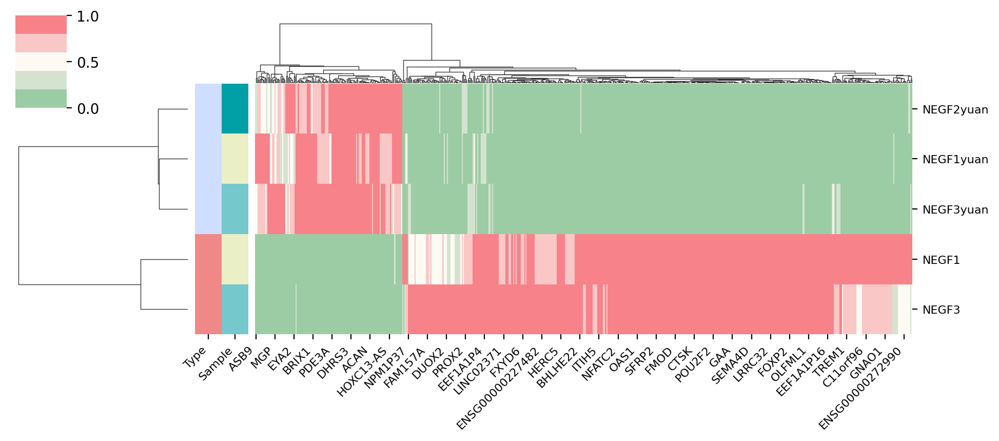

## 3. 热图

带来的第三个图，是一个比较常见的热图，对于热图，网上的教程有很多了，但基本都只是浮于表面，没有真正讲清楚一个好的热图该怎么画出来，
一个好的热图该呈递哪些信息，因此，在本期教程将教大家如何画一个信息丰富的热图

### 3.1 画图配置

我们首先配置一下jupyter的显示效果，这里用了retina作为显示的图片格式，其次导入了一些常见的包，并提供了一个色卡


```python
%matplotlib inline
%config InlineBackend.figure_format = 'retina'

#导入包，我有一个习惯就是把导入的包的版本号同时打印出来，这样别人出问题的时候，也能知道到底是哪个版本没对上
import matplotlib.pyplot as plt
import matplotlib
from matplotlib.colors import LinearSegmentedColormap
import matplotlib.patches as mpatches
print('matplotlib(Ver): ',matplotlib.__version__)

import seaborn as sns
print('seaborn(Ver): ',sns.__version__)

import numpy as np
print('numpy(Ver): ',np.__version__)

import pandas as pd
print('pandas(Ver): ',pd.__version__)

import random

#色卡，这里提供一个我画图常用的色卡，我一般画图的颜色都是从里面选取的
sc_color=['#7CBB5F','#368650','#A499CC','#5E4D9A','#78C2ED','#866017', '#9F987F','#E0DFED',
 '#EF7B77', '#279AD7','#F0EEF0', '#1F577B', '#A56BA7', '#E0A7C8', '#E069A6', '#941456', '#FCBC10',
 '#EAEFC5', '#01A0A7', '#75C8CC', '#F0D7BC', '#D5B26C', '#D5DA48', '#B6B812', '#9DC3C3', '#A89C92', '#FEE00C', '#FEF2A1']
plt.figure(figsize=(8, 2))
for i in range(len(sc_color)):
    plt.scatter(i, 1, c=sc_color[i], s=200)
plt.show()


```

    matplotlib(Ver):  3.5.1
    seaborn(Ver):  0.11.2
    numpy(Ver):  1.23.4
    pandas(Ver):  1.5.1


    


### 3.2 数据准备

#### 3.2.1 导入数据

在这里，我们导入了绘制热图需要的数据，这里的数据是来源于实验组与对照组的基因的表达情况。


```python
#设置文件路径
current_path='/home/xiongyy/analysis/PLOT/'
#使用read_csv导入csv文件
data=pd.read_csv(current_path+'data/data_heatmap.csv')
#设置表头,`inplace=True`代表替换原文件
data.set_index(data.columns[0],inplace=True)
data.head()
```


<div>
<style scoped>
    .dataframe tbody tr th:only-of-type {
        vertical-align: middle;
    }


    .dataframe tbody tr th {
        vertical-align: top;
    }
    
    .dataframe thead th {
        text-align: right;
    }

</style>

<table border="1" class="dataframe">
  <thead>
    <tr style="text-align: right;">
      <th></th>
      <th>NEGF1</th>
      <th>NEGF1yuan</th>
      <th>NEGF2yuan</th>
      <th>NEGF3</th>
      <th>NEGF3yuan</th>
    </tr>
    <tr>
      <th>Unnamed: 0</th>
      <th></th>
      <th></th>
      <th></th>
      <th></th>
      <th></th>
    </tr>
  </thead>
  <tbody>
    <tr>
      <th>ID3</th>
      <td>181</td>
      <td>8455</td>
      <td>10398</td>
      <td>140</td>
      <td>9382</td>
    </tr>
    <tr>
      <th>TXNIP</th>
      <td>6719</td>
      <td>445</td>
      <td>427</td>
      <td>6833</td>
      <td>513</td>
    </tr>
    <tr>
      <th>MMP1</th>
      <td>9307</td>
      <td>551</td>
      <td>426</td>
      <td>9820</td>
      <td>468</td>
    </tr>
    <tr>
      <th>ID1</th>
      <td>207</td>
      <td>9829</td>
      <td>8904</td>
      <td>231</td>
      <td>9901</td>
    </tr>
    <tr>
      <th>PTGIS</th>
      <td>8603</td>
      <td>897</td>
      <td>838</td>
      <td>8684</td>
      <td>942</td>
    </tr>
  </tbody>
</table>

</div>


#### 3.2.2 Meta文件准备

什么是meta文件，就是样本对应的类别文件。我们准备好类别文件后，才能在此基础上进一步画图


```python
meta=pd.DataFrame()
meta['id']=data.columns.tolist()
meta['Type']=['Experiment','Ctrl','Ctrl','Experiment','Ctrl',]
meta['Sample']=['Sample1','Sample1','Sample2','Sample3','Sample3',]
meta=meta.set_index(meta.columns[0])
meta
```


<div>
<style scoped>
    .dataframe tbody tr th:only-of-type {
        vertical-align: middle;
    }


    .dataframe tbody tr th {
        vertical-align: top;
    }
    
    .dataframe thead th {
        text-align: right;
    }

</style>

<table border="1" class="dataframe">
  <thead>
    <tr style="text-align: right;">
      <th></th>
      <th>Type</th>
      <th>Sample</th>
    </tr>
    <tr>
      <th>id</th>
      <th></th>
      <th></th>
    </tr>
  </thead>
  <tbody>
    <tr>
      <th>NEGF1</th>
      <td>Experiment</td>
      <td>Sample1</td>
    </tr>
    <tr>
      <th>NEGF1yuan</th>
      <td>Ctrl</td>
      <td>Sample1</td>
    </tr>
    <tr>
      <th>NEGF2yuan</th>
      <td>Ctrl</td>
      <td>Sample2</td>
    </tr>
    <tr>
      <th>NEGF3</th>
      <td>Experiment</td>
      <td>Sample3</td>
    </tr>
    <tr>
      <th>NEGF3yuan</th>
      <td>Ctrl</td>
      <td>Sample3</td>
    </tr>
  </tbody>
</table>

</div>


#### 3.2.3 类别颜色文件准备

我们得到meta文件后，需要为每一种类别指定一种颜色，在这里，我们就用字典的方式来指定


```python
#指定颜色字典
Type_color_dict={'Experiment':'#F08888','Ctrl':'#CFDEFE'}
Sample_color_dict={'Sample1':sc_color[17],'Sample2':sc_color[18],'Sample3':sc_color[19]}
#meta文件替换，注意，这里我们使用了map来匹配替换
meta_color=pd.DataFrame(index=meta.index.tolist())
meta_color['Type']=meta['Type'].map(Type_color_dict)
meta_color['Sample']=meta['Sample'].map(Sample_color_dict)
meta_color
```


<div>
<style scoped>
    .dataframe tbody tr th:only-of-type {
        vertical-align: middle;
    }


    .dataframe tbody tr th {
        vertical-align: top;
    }
    
    .dataframe thead th {
        text-align: right;
    }

</style>

<table border="1" class="dataframe">
  <thead>
    <tr style="text-align: right;">
      <th></th>
      <th>Type</th>
      <th>Sample</th>
    </tr>
  </thead>
  <tbody>
    <tr>
      <th>NEGF1</th>
      <td>#F08888</td>
      <td>#EAEFC5</td>
    </tr>
    <tr>
      <th>NEGF1yuan</th>
      <td>#CFDEFE</td>
      <td>#EAEFC5</td>
    </tr>
    <tr>
      <th>NEGF2yuan</th>
      <td>#CFDEFE</td>
      <td>#01A0A7</td>
    </tr>
    <tr>
      <th>NEGF3</th>
      <td>#F08888</td>
      <td>#75C8CC</td>
    </tr>
    <tr>
      <th>NEGF3yuan</th>
      <td>#CFDEFE</td>
      <td>#75C8CC</td>
    </tr>
  </tbody>
</table>

</div>


### 3.3 绘制热图

#### 3.3.1 颜色设置

由于我们热图的颜色希望是自定义的颜色集，所以在这里，我们用matplotlib的`LinearSegmentedColormap`构建了属于我们自己的颜色，
`_r`代表颜色翻转，我们利用reverse（）对字符串进行翻转


```python
colors=['#F7828A',"#F9C7C6","#FDFAF3","#D4E3D0","#9CCCA4",]
c = LinearSegmentedColormap.from_list('Custom', colors, len(colors))
colors.reverse()
c_r=LinearSegmentedColormap.from_list('Custom', colors, len(colors))

plt.figure(figsize=(5, 2))
for i in range(len(colors)):
    plt.scatter(i, 1, c=colors[i], s=200)
plt.show()
```


​    

​    


#### 3.3.2 基本热图绘制

我们首先使用seaborn画一个基础的热图


```python
ax=sns.clustermap(data.T, #T代表转置的意思
               cmap=c_r,#c_r是我此前定义的颜色
               standard_scale = 1,#标准化，
               figsize=(10,5),#图像大小
               row_colors=meta_color,#样本类别以及对应的颜色
               )
```


​    

​    


#### 3.3.3 热图字体大小修改

我们发现热图的字体有一些大了，我们希望能让他变小一点


```python
ax=sns.clustermap(data.T, #T代表转置的意思
               cmap=c_r,#c_r是我此前定义的颜色
               standard_scale = 1,#标准化，
               figsize=(10,5),#图像大小
               row_colors=meta_color,#样本类别以及对应的颜色
               )
#设置聚类热图的横坐标标签大小跟角度
xticks=ax.ax_heatmap.xaxis.get_ticklabels()
plt.setp(xticks, rotation=45, horizontalalignment='right',fontsize=8)
#设置聚类热图的纵坐标标签大小
yticks=ax.ax_heatmap.yaxis.get_ticklabels()
plt.setp(yticks, rotation=0, horizontalalignment='left',fontsize=8)
#设置聚类类别方块，也就是Type跟Sample的字体大小跟角度
labels=ax.ax_row_colors.xaxis.get_ticklabels()
plt.setp(labels, rotation=45, horizontalalignment='right',fontsize=8)
#去除横标签
ax.ax_heatmap.set_xlabel('')

```


    Text(0.5, -95.40277777777773, '')


​    

​    


#### 3.3.4 热图图注

我们发现，图注的字体大小没有被修改，此外，我们颜色条对应的图注也不清晰，我们需要额外加上


```python
#设置legend的位置
ax.cax.set_position([-.05, .3, .03, .45])
#设置legend的字体大小及其他属性
labels=ax.cax.get_yticklabels()
plt.setp(labels, rotation=0, horizontalalignment='left',fontsize=8)

ax_gca=plt.gca()
#绘制组别颜色条
for i,loc in zip(['Type','Sample'],[-1,3]):
    legend_li=[]
    for label in meta.index.unique():
        b1=ax.ax_col_dendrogram.bar(0, 0, color=meta_color[i][label],
                                label=label, linewidth=0)
        legend_li.append(b1)
    legend_ = plt.legend(legend_li, meta[i].unique(), fontsize=8,
                                  loc='center',title=i, ncol=1, bbox_to_anchor=(loc, 1, 0.5, 0.5), )
    ax_gca.add_artist(legend_)
ax.ax_row_dendrogram.legend(loc="best", ncol=1,bbox_to_anchor=(-.3, 0.7, 0.5, 0.5),fontsize=15)
```

    No artists with labels found to put in legend.  Note that artists whose label start with an underscore are ignored when legend() is called with no argument.


    <matplotlib.legend.Legend at 0x7f82ffc1f6a0>


​    

​    


### 3.4 小结

到这里，你已经掌握热图的基本绘制原理，我们下期教程再见


```python

```