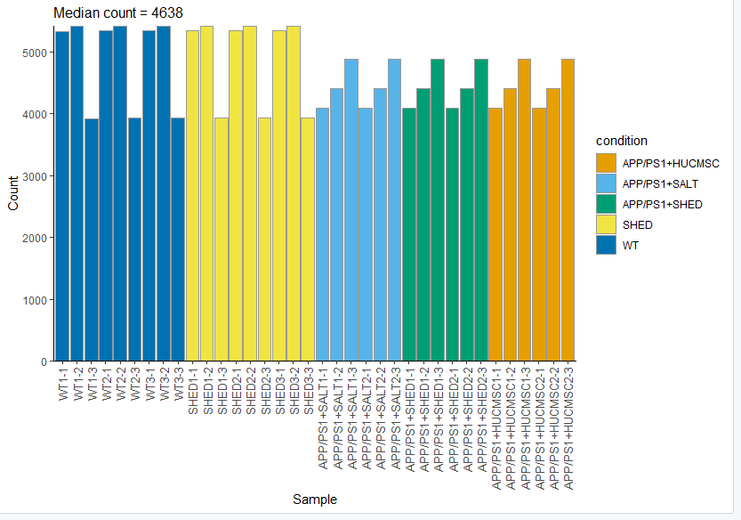
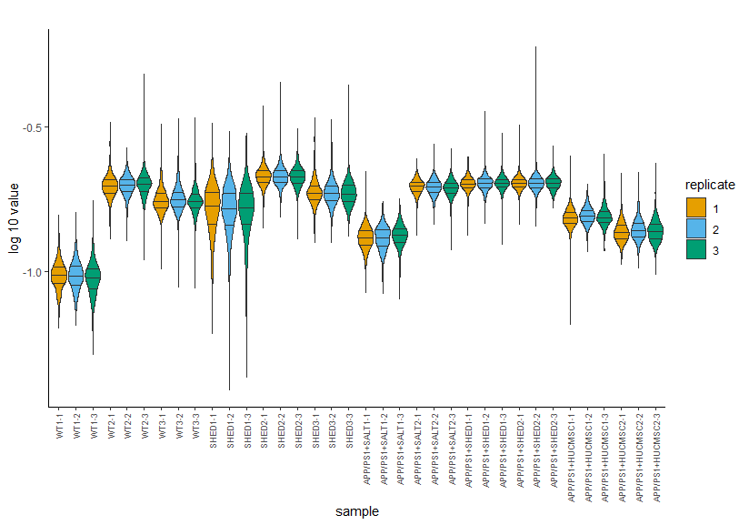
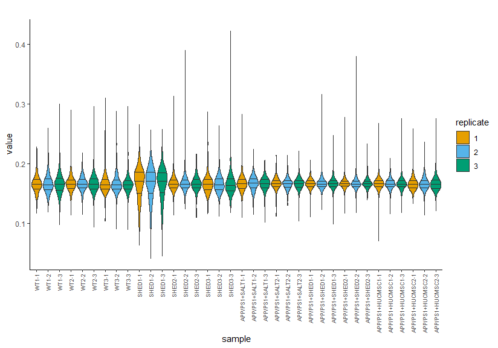
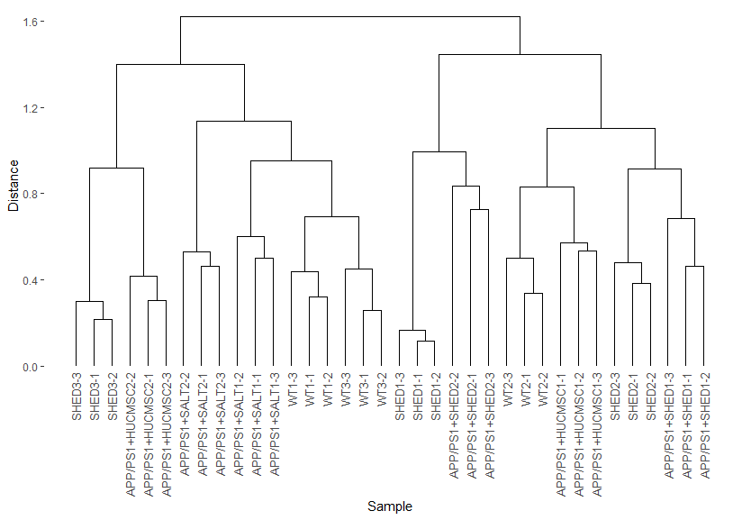

# TMT蛋白组学：下游分析

在前面的分析，我们已经得到了蛋白组学的搜库结果，那么我们怎么才能将其分析出具有生物学意义的东西呢？

在结果的路径下，有一个Combined文件夹，里面的txt文件夹存放了我们的搜库结果，其中的evidence.txt跟proteinGroup.txt为最重要的两个，在这里，我们使用R包proteusTMT进行下游分析。

## 1. 安装依赖

Proteus can be installed directly from GitHub. First, you need to install BioConductor and limma:

```
install.packages("BiocManager")
BiocManager::install()
BiocManager::install("limma")
```

You also need devtools:

```
install.packages("devtools")
```

In order to run examples or vignette code, additional packages with example data need to be installed:

```
devtools::install_github("bartongroup/proteusLabelFree")
devtools::install_github("bartongroup/proteusTMT")
devtools::install_github("bartongroup/proteusSILAC")
```

Finally, you can install proteus:

```
devtools::install_github("bartongroup/Proteus", build_opts= c("--no-resave-data", "--no-manual"), build_vignettes=TRUE)
```

Note: use `build_vignettes = FALSE` if you run into problems with vignettes installation.

## 2. meta文件准备

对于Proteus，其中最为重要的是我们需要对TMT6plex的每一个标记进行标注清楚，在这里，我们准备一个模板作为参考

- experiment：这个是你在上游分析搜库的时候，对每一个raw设置的experiment情况，比如Ctrl1.raw文件里面，包含了6个TMT标记，其中每一个标记代表不同的样本，比如Ctrl1包括了WT1-1，WT2-1，WT3-1，SHED1-1，SHED2-1，SHED3-1，WT1-1指的是野生型的第一个重复
- measure：TMT6plex将返回6个Reporter intensity，每一个对应上述的一个sample
- sample：表示TMT6plex里都有哪六个样本
- condition：样本分组情况
- replicate：重复次数


## 3. Proteus分析

### 3.1 加载依赖

```
library(proteusTMT)
library(proteus)
```

### 3.2 导入数据

#### 3.2.1 列名设置

The default `measure.cols` object is designed for label-free data. For TMT data we need to specify all reporter intensity columns. In out example we have 10 reporter columns, numbered from 1 to 6:

```
measCols <- paste0("Reporter intensity ", 1:6)
names(measCols) <- paste0("reporter_", 1:6)
```

意味着我们将Reporter intensity 1重命名为reporter_1

#### 3.2.2 导入evidence和meta

```
evi <- readEvidenceFile('txt/evidence.txt', measure.cols=measCols)
meta <- read.delim('meta.txt', header=TRUE, sep="\t")
```

#### 3.2.3 创建peptide数据集

```
pepdat <- makePeptideTable(evi, meta, measure.cols=measCols, aggregate.fun=aggregateMedian, experiment.type="TMT")
plotCount(pepdat)
```



### 3.3 蛋白结果数据

#### 3.3.1 创建蛋白结果数据

We create protein data using the high-flyer method.

```
prodat <- makeProteinTable(pepdat, aggregate.fun=aggregateHifly, hifly=3)
```

#### 3.3.2 Normalization

For TMT data we recommend using CONSTANd normalization [Maes et al. 2016](https://www.ncbi.nlm.nih.gov/pmc/articles/PMC4974351/pdf/zjw2779.pdf).

```
prodat.norm <- normalizeTMT(prodat)
write.csv(prodat.norm[["tab"]],file='prodat.csv')
```

These two figures show reporter intensity distributions before and after normalization.

```
plotSampleDistributions(prodat, fill="replicate")
```



```
plotSampleDistributions(prodat.norm, log.scale=FALSE, fill="replicate")
```



#### 3.3.3 Clustering

We can use the same function `plotClustering()` to see the dendrogram for the proteins.

```
plotClustering(prodat.norm)
```



### 3.4 差异表达分析

我们想比较SHED组跟WT组的差异情况，于是

```
res <- limmaDE(prodat.norm, conditions=c("WT", "SHED"))
write.csv(res,file='WT_SHED_result.csv')
```

得到的csv文件与前面的prodat.csv文件，即可参考RNA-seq的下游分析进行，这里不做过多的阐述

RNA-seq下游分析教程：https://starlitnightly.github.io/bioinformatic_tutorial/RNASEQ/rnaseq_2.html